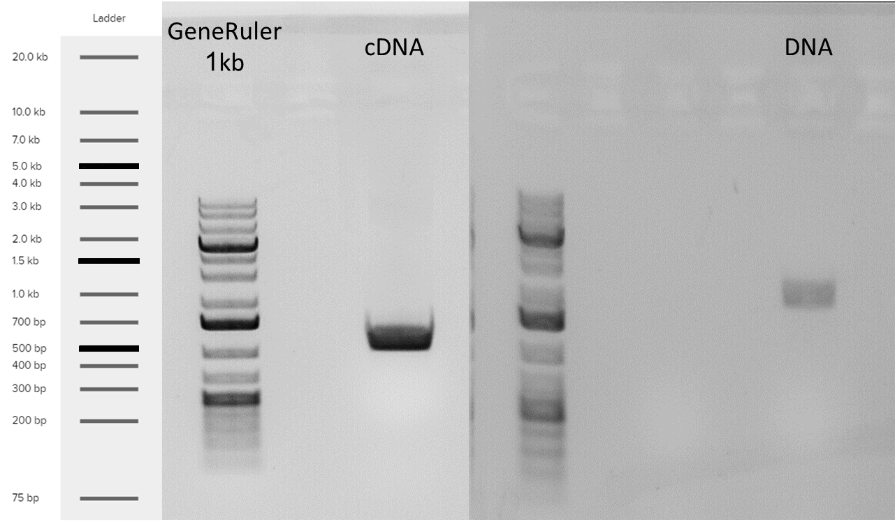

\pagenumbering{gobble}

\begin{center}
   \textbf{\large Under the supervision of\\
                      Dr. Amir Raz\\
                  Prof. Martin Goldway}
\end{center}

\vspace{\fill}

Signature of student:_______________Date:____/____/_______ \hfill \break \newline Signature of supervisor:_______________Date:____/____/_______\hfill \break \newline Signature of supervisor:_______________Date:____/____/_______ \hfill \break \newline Signature of chairperson for graduate studies:_______________Date:____/____/_______

\begin{titlepage}
   \begin{center}
       
        \includegraphics[width=0.5\textwidth]{telhai logo.jpg}
        
        \vspace{0.5cm}

       \textbf{\Huge THE FACULTY OF SCIENCES\\ MASTER IN BIOTECHNOLOGY}

       \vspace{2cm}
       \textbf{\huge Developing novel methods for gene editing in trees}
            
       \vspace{3cm}

       \textbf{\Large Ben Sivan}
       
        \vspace{1cm}

       \textbf{\large Under the supervision of\\
       Dr. Amir Raz\\
       Prof. Martin Goldway}
       
       \vspace{1cm}

       \textbf{\large Thesis submitted in partial fulfillment of the requirements for the master of science degree in biotechnology}
       
       \vfill
     
       Department of Biotechnology\\
       Tel-Hai collage\\
       Israel\\
       October 2021
            
   \end{center}
\end{titlepage}

\newpage

\setcounter{tocdepth}{3}
\tableofcontents
\newpage

\listoffigures
\newpage

\listoftables
\newpage

\pagenumbering{arabic} 
\setcounter{page}{7}

```{r setup, include=FALSE}
knitr::opts_chunk$set(echo = TRUE, fig.pos= "h")
```

```{r library, echo=FALSE, message=FALSE, warning=FALSE, results='asis'}
library(knitr)
library(kableExtra)
library(tidyverse)
library(ggpubr)
library(latex2exp)
```

# Abstract

Global environmental change undermines food security. In comparison to most crops, trees are resilient to temperature fluctuations and
consequently offer vital insurance against famine. Crop improvement with available methods reaches a glass ceiling and genetic modification can contribute substantially to break through the barrier. Tissue culture is a required step in most genetic modification methods. Yet, tissue culture has its issues and the process is far from routine in most laboratories. In trees, because of long generation time, tissue culture issues become much more pronounced. In this work we are attempting to implement a novel gene editing method that doesn't require tissue culture such as de-novo meristem induction and transformation, on trees. In this work we used _Agrobacterium tumefaciens_ as the vector for in-planta transformation. We used apples as a commercial fruit tree crop and poplar as a model system for trees. We experimented with a wide range of development regulators, and a few agroinfiltration strategis. Additionally we analyse tissue specific transcriptome to further understand gene expression patterns in tissue development, and scan for better normalizer genes for real-time quantitive PCR. In this work We have shown that over expression of the gene combination _WUS2-STM_ and _WOX11-STM_ were successful in invoking de-novo shoot regeneration in a young apple plants, in-planta. Further we found ,based on the tissue specific transcriptome, that in poplar the most shoot tip specific transcription factor from the WUSCHEL family is WOX1. 

# Introduction

## Trees and their vital role as source for food security

Food security is a fundamental necessity that kept mankind busy from the beginning of time. Many researchers today estimate that this need is under threat as a result of global environmental changes through land degradation, loss of biodiversity, changes in hydrology, and changes in climate patterns[@Ericksen2009]. Moreover population growth is around 100 milion per year. Since the early 1990s, the number of extreme weather-related disasters has doubled[@FAO2020a]. Higher temperatures, water scarcity, extreme events like droughts and floods have already begun to impact staple crops around the world[@Linden2015] and have reduced the yields of major crops like maize and wheat[@Rosenzweig2001]. According to the Food and Agriculture Organization of the United Nations, the climate variability has an impact of at least 80% to the unpredictable reduction in yield of cereal crops in semi-arid regions of the world such as the Sahel region of Africa[@Shiferaw2014].

Fruit trees contribute in many ways to improving diets and combating hunger around the world[@Vinceti2013]. Trees are much more resilient to extreme weather-related disasters in comparison to most crops, and consequently they can offer vital insurance against famine during times of seasonal food shortages due to droughts, floods and heat/cold waves. This is the main reason behind the evergreen agriculture approach[@Garrity2010]. Trees resilient is due to their being perennial woody plants, which allows them to grow strong, with durable trunk and long roots. In addition, fruit trees are able to produce large yield on a given area resulting from  their vertical growth. However, plant improvement methods raises a drawback since trees have a long generation time.

## Classical plant improvement methods for trees on a human time scale

Since mankind developed the ability to grow plants for food, methods were developed to improve yield. The most ancient method is the selection and propagation of plants with preferred traits such as larger seeds. This method creates an artificial selection pressure that allows the highlighting of desirable traits in the plant. However this process is dependent on random mutations, making it slow. Further more, undesirable additional traits may appear.

The second method that man has developed for improving the crop is breeding. Breeding at its core is based on the idea of merging traits from differente lines to a single cultivar through crossbreeding. In most cases, there is an all ready main cultivar line that harbors a variety of desirable triats and probably used as a commertial line. That cultivar would be crossbred with some exotic line whose over all traits (or phynotype) are not at the commercial standart but withhold some favorable trait. The descendants of that cross would have equal parts of genetic matirial donated from each of the parents, and through the proccess of backcrossing with the commertial parent and selecting for offsprings based on thier phynotype, it is possible to narrow in on a descendant with much of the commercial phynotype but that also keeps the desirable trait from the exotic line. This is why the commercial parent is often called the recurrent parent, and the exotic one is called the donor. Although this method is faster, this proccess takes many generations and even in annual plants takes a few years. Still, impressive results have been obtained in annual crops that have changed the fate of the human race to extremes. In trees, the time from polination to a grown fruit bearing tree takes a few years in of itself. As a result, to take the breeding proccess as is and apply it on trees takes decades. Therefor the realization of the potential in trees is not as high.

## Genetic modification as a viable solution for trees improvement

With the understanding that the inherited genetic material is DNA, the ability was developed to utilize the acceleration of random mutations as a way of gaining genetic diversity and selecting based on the phynotipic outcome. By exposing seeds to chemicals or radiation we are able to increase the frequency of mutation events, some fraction of those mutations results with desirable traits. This process is called mutation breeding and plants created using mutagenesis are sometimes called mutagenic plants or mutagenic seeds. There are different kinds of mutagenic breeding, for instance such as chemical mutagens like ethyl-methanesulfonate and dimethyl-sulfate, or radiation such as gamma rays and X-rays[@Schouten2007]. Although this method increase the rate of random mutation formation, its still relies on random occurrences and offspring selection.

As a result of the genetic revolution, many genetic modification technologies were developed, some of them relevant for plants too. Those methods are more direct in their approach to manipulate DNA for an expected outcome. They can be divided into two groups, exogenous DNA delivery methods and site-specific endonucleases. 

## Exogenous DNA delivery methods  
  
Techniques developed for the introduction of foreign DNA genes (exogenous) into a cell.

### Biolistic particle delivery system or Gene gun  

Gene gun or biolistic particle delivery system is a device used to deliver exogenous DNA (transgenes), RNA, or protein to cells. By coating particles of a heavy metal with a gene of interest and firing these micro-projectiles into cells using mechanical force, an integration of desired genetic information can be induced into cells. The technique involved with such micro-projectile delivery of DNA is often referred to as biolistics[@OBrien2011]. This device is able to transform almost any type of cell and is not limited to the transformation of the nucleus, it can also transform organelles, including plastids and mitochondria[@Rakoczy-Trojanowska2002]. Biolistics has proven to be a versatile method of genetic modification and it is generally preferred to engineer transformation-resistant crops, such as cereals. Notably, Bt maize is a product of biolistics. Biolistics introduces DNA randomly into the target cells. Thus the DNA may be transformed into whatever genomes are present in the cell, either nuclear, mitochondrial, plasmid or any others, in any combination, though proper construct design may mitigate this. The delivery and integration of multiple templates of the DNA construct is a distinct possibility, resulting in potential variable expression levels and copy numbers of the inserted gene[@Shewry2008149].

### Protoplast transformation  
  
Protoplast refers to the entire cell excluding the cell wall. Protoplasts can be generated by stripping the cell wall from plant, bacterial, or fungal cells by mechanical, chemical or enzymatic means[@davey2005plant]. The advantages of using protoplast in comparison to a whole cell is the direct access to the cells membrane which result in increase uptake of DNA and increase transformation frequency. Treatment of protoplast-plasmid mixtures with PEG and/or electroporation is the approach normally exploited to induce DNA into protoplasts. However, transformation frequencies typically remain low (ca. one in 104 protoplasts giving stably transformed tissues)[@davey2005plant]. Heat shock treatment and irradiation of recipient protoplasts enhance transformation frequency, probably by increasing the recombination of genomic DNA with incoming foreign DNA, or the initiation of repair mechanisms that favour DNA integration. Carrier DNA and the nature of the plant genome also affect transformation[@davey2005plant]. DNA uptake into protoplasts has been especially important in transforming plants that are not amenable to other methods of gene delivery, particularly agrobacterium-mediated transformation. Many of such studies focused on cereals, particularly rice, once protoplast-to-plant systems became available for these crops[@Rakoczy-Trojanowska2002]. However, protoplast regeneration into mature plants is hard to achieve in most plants, which is the major holdback of this approach.

### Agrobacterium-mediated transformation  
  
Agrobacterium is a genus of Gram-negative bacteria that uses horizontal gene transfer to cause tumors in plants. _Agrobacterium tumefaciens_ is the most commonly studied species in this genus. Agrobacterium is well known for its ability to transfer DNA between itself and plants, and for this reason it has become an important tool for genetic engineering. The ability of Agrobacterium to transfer genes to plants and fungi is used in biotechnology, in particular, genetic engineering for plant improvement. Genomes of plants can be engineered by use of Agrobacterium for the delivery of sequences hosted in transfer of a DNA segment (T-DNA) binary vector. The essential parts of the T-DNA are its two small (25 base pair) border repeats, at least one of which is needed for plant transformation. The genes to be introduced into the plant are cloned into a plant binary vector that contains the T-DNA region, together with a selectable marker (such as antibiotic resistance) to enable selection for plants that have been successfully transformed. Plants are grown on media containing antibiotics following transformation, and those that do not have the T-DNA integrated into their genome will die[@Mukeshimana2013]. The most common methodology for introducing Agrobacterium to plant tissues is in liquid suspension of sectors of somatic tissue (explant), then co-culture on agar medium in the dark. Another method is Agroinfiltration, used to induce transient expression of genes in a plant. Agroinfiltration is performed by direct injection or by vacuum infiltration of suspended _Agrobacterium tumefaciens_ into a plant leaf. The main benefit of agroinfiltration when compared to the more traditional plant transformation is speed and convenience, although yields of the recombinant protein in traditional methods are generally higher and more consistent[@Undervisningsministeriet2014]. Floral dipping is another method that allows efficient plant agrobacterium-mediated transformation without need for tissue culture[@Zhang2006]. 

## Site-specific endonucleases

Site-specific endonucleases are enzymes that are capable of dissecting nucleic acid strands such as DNA or RNA at a specific target sequence. In contrast to restriction enzymes, this sequence can be engineered and hold longer sequences which increase it's specificity.

### Zinc Finger Nucleases (ZFNs)   
  
A zinc finger is a small protein structural motif that is characterized by the coordination of one or more zinc ions (Zn2+) in order to stabilize the fold. The ability to engineer zinc fingers to have an affinity for a specific sequence of DNA, made them suitable for important applications such as zinc finger nucleases and zinc finger transcription factors. While significant progress has been made in ZFNs engineering capability, a barrier to their widespread adoption has been the challenge in engineering new DNA binding specificities[@Chandrasegaran1996].

### Transcription Activator-like Effector Nucleases (TALENs)  
  
Transcription activator-like effector nucleases are restriction enzymes that can be engineered to cut specific sequences of DNA. They are made by fusing a TAL effector DNA-binding domain to a DNA cleavage domain (a nuclease which cuts DNA strands). The simple relationship between amino acid sequence and DNA recognition of the TALE binding domain allows for the efficient engineering of proteins. That said, the failure of some custom TALENs suggests that yet unknown rules govern the assembly of functional repeat domains. For example, repeat composition may influence protein stability[@Christian2010].

### Clustered Regularly Interspaced Short Palindromic Repeat (CRISPR) 
  
CRISPR systems are part of the adaptive immune system of bacteria and archaea, protecting them from invading viruses by cleaving their DNA in a sequence-dependent manner. The immunity is acquired by the integration of short fragments of the invading DNA known as spacers between two adjacent repeats at the proximal end of a CRISPR locus. The CRISPR arrays, including the spacers, are transcribed during subsequent encounters with invasive DNA and are processed into small interfering CRISPR RNAs (crRNAs) approximately 40 nt in length, which combine with the transactivating CRISPR RNA (tracrRNA) to activate and guide the CRISPR Assosiated 9 (Cas9) nuclease[@Barrangou1709]. A prerequisite for cleavage is the presence of a conserved protospacer-adjacent motif (PAM) downstream of the target DNA, which usually has the sequence 5'-NGG-3'[@GasiunasE2579]. Jinek et al., re-engineered the Cas9 endonuclease into a more manageable two-component system by fusing the two RNA molecules into a "single-guide RNA"(sgRNA) that, when combined with Cas9, could find and cut the DNA target specified by the guide RNA. By manipulating the nucleotide sequence of the guide RNA, the artificial Cas9 system could be programmed to target any DNA sequence for cleavage[@Jinek2012]. The Nobel Prize in Chemistry 2020 was awarded to Emmanuelle Charpentier and Jennifer A. Doudna for the development of the CRISPR/Cas9 enzyme as a genetic editing tool.

## Genetic Editing bottleneck

Bottlenecks need to be overcome before the full potential of this technology is realized in plants. Plants distinguish themselves from most complex eukaryotes in the totipotency of their tissues[@Indra1972]. This has long allowed researchers to convert explant into a whole plants, with the use aseptic tissue culture growth medium. This somatic-germinal conversion (or regeneration) is the foundation of most plant transformation approaches. Transgenes are delivered to isolated somatic tissue followed by selection for the transgene and regeneration of the modified tissue into a whole, transgenic plant[@Rasmussen2017]. Despite many of these protocols being developed over decades, the process is far from routine in most laboratories. Further,success is often genotype dependent because specific growth medium need to be tuned for each new plant and the regenerated plants can have changes to their genome and epigenome[@Kaeppler2000]. In trees, because of long generation time, the issues of maintaining asceptic enviroment and assessing growth medium suitability in real time become much more pronounced.

Crop production globally is improving, but this trend seems to approach a plateau (Figure \ref{fig:agricultural area per capita}). Hence substantial changes in methods for agronomic processes and crop improvement are required[@TesterMarkandLangridge2010]. 

```{r agricultural area per capita, echo=FALSE, message=FALSE, warning=FALSE, fig.pos="H", out.width = "70%", fig.align="center", fig.cap="Agricultural area per capita world-wide in hectare/person. \\newline{} \\textbf{Line.} Average area \\textbf{Ribbon.} Maximum and minimum values  \\newline{} https://ourworldindata.org/"}

agricultural_area_per_capita_summary <- read.csv("agricultural_area_per_capita_summary.csv")

agricultural_area_per_capita_summary_fig = agricultural_area_per_capita_summary %>% ggplot(aes(x = Year)) + geom_ribbon(aes(ymin=Min, ymax=Max), fill = "grey70") + geom_line(aes(y = Avg)) + ylab("hactare/person") + theme_classic()

agricultural_area_per_capita_summary_fig
```


## Advance genetic Editing technologies

Most of the advanced methods of genetic editing are designed to help solve problems arising from the use of tissue culture, or to completely spare the need to use it. Tissue culture is designed to allow for the capture of rare cell-transformed events. This is done by providing a supportive environment for the explant, whose needed to expose as much as possible inner cells of the plant to the genetic manipulation and later allow for regeneration and differentiation to a new plant. For the most part, the regeneration begins with differentiation to a shoot meristem, and later to a full shoot. The route from shoot to a full plant through the induction of roots is much more approachable. The common way to induce the explant for meristem differentiation and shoot formation is with the use of plant hormones. Hormones can effect a vast array of genetic pathways, with the right hormone concentration balance at the right time it is possible to dirrect the tissue to any differentiation path we desire. The drawback of using hormones is the precise application needed and the broad spectrum of effects it have on the tissue such as epigenetic changes. In order to mitigate those drawbacks, researchers tried to induce regeneration with a less comprehensive effects on the plant by switching on specific genetic pathways with the use of trascription factors. those transcription factors are referred to as developmental regulators (DRs). It has been shown that by over expressing some DRs in the cell it would be possible to differentiate the cells in a more precise manner, similar to the work on induced pluripotent stem cells in humans. Some other work have been done to mitigate other drawbacks of tissue culture like precise growth medium and asceptic enviroment by utelizing the plant own enviroment to create a controled micro enviroment in-planta. Lately Zhang et al. shown promising work on pomelo, in which they intruduce a hybrid method of in-planta and tissue culture, where the transformation took place in a close environment around incision on soil grown plant, with the use of antibiotics as selection and hormones for development induction[@Zhang2017]. This method is revolutionaty in that tissue that is still attached to the plant is much less susceptible to contaminations and most of its micronutrients can come from the neighboring tissues. Maher et al.[@Maher2020] introduced the next step in independence from tissue culture by combining the two approaches of in-planta transformation and de-novo maristem induction. In that mathod developmental regulators (DRs), CRISPR/Cas9 and sgRNA are delivered to somatic cells of whole plants through Agroinfiltration. This induces meristems that produce shoots solely in cells that were infected successfully with T-DNA bearing CRISPR/Cas9 and sgRNA.

Examples of developmental regulators (DRs):

-   Wuschel2 (_WUS2_) from _Zea mays_ (Maize) is a transcription factor that plays a central role during early embryogenesis, organogenesis and flowering, probably by regulating expression of specific genes. Required to specify stem cell identity in meristems, such as shoot apical meristem (SAM)[@Maher2020].

-   Shoot meristemless (_STM_) from _Arabidopsis thaliana_ appears to function in keeping central meristem cells undifferentiated, thus
playing a major role in maintaining shoot and floral meristems[@Maher2020].

-   Isopentenyl transferase (_IPT_) from the Ti-plasmid of _Agrobacterium tumefaciens_ is a key enzyme in cytokinin biosynthesis[@Maher2020].

-   Wuschel-related homeobox 11 (_WOX11_) from _Populus trichocarpa_ (Poplar tree) acts as master regulator conducting the expression of key  transcription factors to induce de novo shoot organogenesis in poplar[@Liu2018a].

DRs have a long history in plant development research and in recent years are utilized in transformation methods. WUSCHEL is the most known DR that is involved in the meristem cell identity. Several more DRs were identified in their capability to induce cell potency like the tumor induced gene IPT from _Agrobacterium tumefaciens_. Novel methods for the identification of new tissue specific transcription factors and their goal as a DRs in the cell became possible and commonly used, such as tissue specific transcriptome.

## Green fluorescent protein (GFP) as a reporter gene for transformation
The green fluorescent protein is a protein that exhibits bright green fluorescence when exposed to light in the blue to ultraviolet range. In this study, it is used as a reporter gene for the agrobacterium transformation.
    
## Poplar as a model organism for trees
*Populus* is a model system for some aspects of tree research for several reasons. It has a rapid growth rate compared to other trees, it is easy to propagate and transform and it has a relatively small genome [@Taylor2002], 45 time smaller than that of pine tree. The target gene that we choose for poplar is the Phytoene desaturase (PDS) gene, because it is a well known reporter gene for gene editing. PDS gene encodes one of the important enzymes in the carotenoid biosynthesis pathway. Knockout of PDS gene disrupt the carotenoid synthesis and results in susceptibility to photobleaching of the chloroplasts, which in turn results in albino and dwarf phenotype. Thus, it is a suitable target for evaluation of gene knockout occurrences.

## Apple tree as a commertial crop
Apple trees are one of the most widely grown fruit tree in the world. In this study, apple plants are used as the commercial application for the transformation method. As a member of the Roseaceae plant family it carries the Self-incompatibility (SI) ferlilization system. SI is a complex system, one out of several mechanisms that prevent plants from self-fertilizing mainly by rejection of the male gametophyte to maintain and increase the genetic variability. Plants have evolved two distinct SI systems, the sporophytic (SSI) and the gametophytic (GSI) systems. In *Malus domestica* (Apple), the GSI system requires the production of female determinants, known as S-RNases, which is produced in the style and penetrate the pollen tube to interact with the male determinants. The penetration of S-RNase into the pollen tube triggering a series of responses involving membrane proteins that inhibits the pollen-tube’s growth process [@DelDuca2019]. Inactivation of S-RNase results in self-compatibility plants [@goldway2012self] hence preventing the need of cross pollination and allowing orchards of a single cultivar (in contrast to SI cultivars that requires cross pollination and at least 
two cultivars that pollinate each other). However, up to date non of apple cultivar are self compatible and following that we choose S-RNase as the target for gene editing.

## Hypothesis
By infecting young plants with _Agrobacterium tumefaciens_ harboring T-DNA that contains DRs, CRISPR/Cas9 and sgRNA, it is possible to achieve de-novo shoot regeneration with knockout at the target gene.

## Milstones
* Contraction of vectors with mix of DRs for shoot regeneration examination.

* Achieve de-novo shoot regeneration as a result of the agro-infiltration.

* Observe mutation in the target sequence.  

## Goal
* Develop new method for in-planta trees transformation.


#  Materials and methods

The main goal of this work is to develope a protocol as the final product. For that purpose we use an array of already established protocols for the preperation and validation of our experiments. Some of the protocols use in this work were used as is from the source, but many others were changed to fit our specific use case.

## Plant matirial 

For the experiments in this work, we used two types of plant material. The first is _Populus Alba-Tremula_ (PopAT) cultivar, which were reproduced by vegetative reproduction in tissue culture (Table \ref{tab:Poplar mediums}). The second is _Malus domestica_ (apple) cultivar, from seeds that were extracted from apple fruits.

```{r Poplar mediums, echo=FALSE}

Components = c("","","MS","Sucrose","Agar","NAA","BAP","IBA","Kanamycin","Cefotaxime","Timentin","pH")
M1 = c("(Plant Propagation","and Pre-Culture)","4.43 g/L","30 g/L","5.8 g/L","","","","","","","5.8")
M2 = c("(Co-Culture)","","4.43 g/L","30 g/L","5.8 g/L","0.05 mg/L","0.5 mg/L","","","","","5.8")
M3 = c("(Shoot Induction)","","4.43 g/L","30 g/L","5.8 g/L","0.05 mg/L","0.5 mg/L","","30 mg/L","200 mg/L","200 mg/L","5.8")
M4 = c("(Root Induction)","","2.215 g/L","30 g/L","5.8 g/L","0.02 mg/L","","0.05 mg/L","30 mg/L","200 mg/L","200 mg/L","5.8")


mediums = data.frame(Components = Components, M1 = M1, M2 = M2, M3 = M3, M4 = M4)

sep = c(rep('',length(Components)))                             
kable(mediums, caption = "Composition of media for cultivation, tranformation, selection and regenetarion of hybrid poplar P.alba X P.glandulosa",booktabs = TRUE, align = "ccccc", linesep = sep) %>% kable_styling(latex_options = "HOLD_position")
```
## Matirials
* [Petri-dish](https://shop.gbo.com/en/row/products/bioscience/microbiology-bacteriology/dishes/petri-dishes/) (Greiner Bio-One™)
* [Magenta™ vessel](https://www.sigmaaldrich.com/IL/en/substance/magentavessel1234598765)
* PARAFILM® (Sigma-Aldrich™)
* [Lysogeny broth](https://www.formedium.com/product/lb-broth-lennox/) (LB from ForMedium™)
* [Agar](https://www.formedium.com/product/agar/)
* Murashige & Skoog (MS from Sigma-Aldrich™)
* [CTAB](https://www.sigmaaldrich.com/catalog/product/sigma/h6269?lang=en&region=IL) (Sigma-Aldrich™)
* Acetosyringone (Sigma-Aldrich™)

### antibiotics
* Ampicillin (Sigma-Aldrich™)
* Kanamycin (Sigma-Aldrich™)
* Rifampicin (Sigma-Aldrich™)

### Kits
[Miniplsmid putification kit](https://www.geneaid.com/product.php?act=view&id=180) (Presto™)

### Instruments
* [MicroPulser Electroporator by Bio-Rad](https://www.bio-rad.com/en-il/product/micropulser-electroporator?ID=83527990-34fb-4b33-b955-ca53b57bf8b9)
* [Microcentrifuge](https://www.thermofisher.com/order/catalog/product/69720#/69720) (Pierce™)
* PCR machine [Biometra TRIO](https://www.analytik-jena.com/products/life-science/pcr-qpcr-thermal-cycler/thermal-cycler-pcr/biometra-trio-series/)
* Power supply + Electrophoresis bath ([PowerPac™ Basic Power Supply](https://www.bio-rad.com/en-il/product/powerpac-basic-power-supply?ID=bea5dea1-cef0-43ad-8af5-b2c0287f6e07), [Wide Mini ReadySub-Cell GT Horizontal Electrophoresis System](https://www.bio-rad.com/en-il/sku/1704489-wide-mini-readysub-cell-gt-horizontal-electrophoresis-system-for-precast-gels?ID=1704489))
* UV-light table [($UV_{DOC}$ HD2 by Uvitec Cambridge)](https://topac.com/documents/geldoc_%20catalogue.pdf)

## Protocols
* [Gibson Assembly Cloning](https://www.addgene.org/protocols/gibson-assembly/) [@Gibson2009]: In 2009 Dr. Daniel Gibson and colleagues at the J. Craig Venter Institute developed a novel method for the easy assembly of multiple linear DNA fragments. Regardless of fragment length or end compatibility, multiple overlapping DNA fragments can be joined in a single isothermal reaction. With the activities of three different enzymes, the product of a Gibson Assembly is a fully ligated double-stranded DNA molecule. This has proven to be an efficient and effective method for the assembly of plasmids, and molecular biologists now use this method extensively.

* [Golden-Gate cloning](https://blog.addgene.org/plasmids-101-golden-gate-cloning)[@Cermak2017]: Golden Gate cloning technology relies on Type IIS restriction enzymes, first discovered in 1996. Type IIS restriction enzymes are unique from "traditional" restriction enzymes in that they cleave outside of their recognition sequence, creating four base flanking overhangs. Since these overhangs are not part of the recognition sequence, they can be customized to direct assembly of DNA fragments. When designed correctly, the recognition sites do not appear in the final construct, allowing for precise, scarless cloning.

* Gel agarose for DNA electrophoresis[@Lee2012]: Agarose gel electrophoresis is the most effective way of separating DNA fragments of varying sizes ranging from 100 bp to 25 kb. During gelation, agarose polymers associate non-covalently and form a network of bundles whose pore sizes determine a gel's molecular sieving properties. To separate DNA using agarose gel electrophoresis, the DNA is loaded into pre-cast wells in the gel and a current applied. The phosphate backbone of the DNA (and RNA) molecule is negatively charged, therefore when placed in an electric field, DNA fragments will migrate to the positively charged anode. Because DNA has a uniform mass/charge ratio, DNA molecules are separated by size within an agarose gel in a pattern such that the distance traveled is inversely proportional to the log of its molecular weight.

* E.coli Heat-shock competent preperation and [transformation](https://www.addgene.org/protocols/bacterial-transformation/)[@Chang2017]: Calcium chloride heat-shock transformation is a powerful molecular biology technique used to introduce foreign DNA into a host cell. The concept of the technique is to encourages bacterial cells to uptake DNA from the surrounding environment when stressed by heat shock by using CaCl2 to render them more competent. This technique allow for introduction of plasmid for bacterial transformation.

* CTAB protocol for the isolating of DNA from plant tissues[@Porebski1997]: A relatively quick, inexpensive and consistent protocol for extraction of DNA from plant tissues. CTAB extraction, employing high salt concentrations to remove polysaccharides, the use of polyvinyl pyrrolidone (PVP) to remove polyphenols, an extended RNase treatment and a phenol-chloroform extraction.


# Experimants scheme

## Implementing De-novo maristem induction and transformation.

### Construction of plasmids containing DRs, Cas9 and sgRNAs

Constructing plasmids with combinations of DRs for de-novo maristem induction for novel transformation protocol.

All the plasmid building blocks for the final vectors are bought from [Addgene](https://www.addgene.org/) (Table \ref{tab:Building blocks}), except for pMOD-B with S-RNase sgRNA array and pMOD-C with WOX11 from _Populus trichocarpa_ which was assembled in-house.

```{r Building blocks, echo=FALSE}

Name = c("pTRANS_221","","pMOD_B2103","pMOD_C'5014","pMM107","pRN110")
Purpose = c("Empty Backbone with Cas9-csy4 gene","and kana resistance","cassette for cloning multiple gRNA","Module C' with Pnos::WUS2","Module C' with 35S::IPT","Module D' with CmYLCV::STM")
BackBone = c("pCAMBIA","","pMOD_B2000","pMOD_C'4800EC","pMOD_C'5014","pMOD_D4800EC")
Insert = c("None","","None","WUS2","IPT","STM")
Species = c(" ",""," ","Maize","A.tumefaciens","A.thaliana")
Number = c(91115,"",91061,127219,127227,127228)


building_blocks = data.frame(Name = Name, Purpose = Purpose, BackBone = BackBone, Insert = Insert, Species = Species, Number = Number)
                             
sep = c(rep('',length(Name)))
kable(building_blocks, caption = "Building blocks from Addgene",booktabs = TRUE, linesep = sep) %>%
  kable_styling(latex_options = "HOLD_position")
```

* **Species** column refers to the insert's origin species.

For the assembly and validation off the final vectors, costume primers were used as detailed in Table \ref{tab:Primers}.

```{r Primers, echo=FALSE}
primers <- read.csv("primers.csv")

sep <- c()
for (row in 1:(nrow(primers)-1)) {
  if (primers[row+1,"Purpose"] == ""){
    sep <- append(sep,'')
  }
  else{
    sep <- append(sep,'\\addlinespace')
  }
}

kable(primers, caption = "All primers" ,booktabs = TRUE, linesep = sep) %>%
  kable_styling(latex_options = "HOLD_position")
```

The gene _WOX11_ from _Populus trichocarpa_ were synthesized into pUC57 plasmid as a service from [GenScript](https://www.genscript.com/)(New Jersey, USA) and were assembled into pMOD-C backbone using [Gibson Assembly Cloning](https://www.addgene.org/protocols/gibson-assembly/) protocol[@Gibson2009] (Table \ref{tab:Primers}).

The final plasmids were constructed into pTRANS backbone using [Golden-Gate cloning](https://blog.addgene.org/plasmids-101-golden-gate-cloning)[@Cermak2017] (Table \ref{tab:AllConstracts}).

```{r AllConstracts, echo=FALSE}
AllConstracts <- read.csv("AllConstracts.csv")

sep <- c()
for (row in 1:(nrow(AllConstracts)-1)) {
  if (AllConstracts[row+1,"Target"] == ""){
    sep <- append(sep,'')
  }
  else{
    sep <- append(sep,'\\addlinespace')
  }
}

kable(AllConstracts, caption = "De-novo maristem induction constracts" ,booktabs = TRUE, linesep = sep) %>%
  kable_styling(latex_options = "HOLD_position")
```

Transformation of Top10 bacteria with constructs for replication was preformed using [heat-shock transformation](https://www.addgene.org/protocols/bacterial-transformation/) and growing on petri-dish containing Lysogeny broth medium with 1.1 % Agar 50 mg/L Ampicillin, at $37^oC$ over-night. Evaluating constructs using colony PCR (Polymerase chain reaction) reaction (Table \ref{tab:Primers}). Growing positive colonies in LB liquid-medium (containing 50 mg/L Ampicillin), shaking 200 rpm over-night at $37^oC$. Purifying constructs using miniplsmid putification kit. 

Transformation of EHA-105 agrobacterium using electroporation MicroPulser Electroporator and growing on petri-dish containing LB-agar medium with 50 mg/L Ampicillin and 50 mg/L Rifampicin at $28^oC$ for 2 days. Positive colonies are validated again using colony PCR. 

Cultures of each positive EHA-105 agrobacterium are spread on new petri-dish containing LB-agar medium with 50 mg/L Ampicillin and 50 mg/L Rifampicin at $28^oC$ for 4 days. At the day of plant transformation, the whole plate is picked using Drigalski spatula and transferred to 2 ml Microcentrifuge with a tip. The transferred colonies are weighed and elut in 2 $\mu l$ per mg Liquid medium containing $1/2$ MS, 1 % sucrose and 200 $\mu M$ acetosyringone.

### Infection methods experiment

The first experiment is designed for the assessment of different infection methods on the agro-infection effectiveness.
Seeds are extracted from apple of the variety Pink-lady, that have been refrigerated for few months. The seeds are then grown in a germination tray (11X17 cells) for 1 month.

Three methods of Agro-infection was tested on the plants. The first is agro-infiltration to the leaves through pressure with needleless syringe. The second is micro-stabs of concentrated bacteria culture into the leaf vains. The last is vertical cut of the stem as far as possible from the nearest axillary bud below and injection of concentrated bacteria culture into the cut (Figure \ref{fig:Agro-infection methods}). Each infection method got repetitions with each construct as follows: first 4, second 3, third 1. 


```{r Agro-infection methods, out.width = "100%", fig.align="center", echo=FALSE, fig.cap="Infection of Apples with A.tumefaciens, three methods. \\newline{} \\textbf{A.} agro-infiltration to the leaves \\textbf{B.} micro-stabs to the leaf vains \\textbf{C.} injection to the stem cut"}
include_graphics("apple injection3.png") 
```

### DRs experiment

The second experiment is designed for the assessment of different DRs on the de-novo shoot induction influence.
Seeds are extracted from 4 varieties of apples that have been refrigerated for few months (Pink Lady, Granny Smith, Starking, Golden Delicious). The seeds are then grown in a germination tray (11X17 cells) for 1 month.

All plant are infected as described in method C (Figure \ref{fig:Agro-injection}). After injection, all stem cuts are covered with PARAFILM for 1 week. New shoots that grow from axillary buds are removed once a week.

```{r Agro-injection, out.width = "100%", fig.align="center", echo=FALSE, fig.cap="Injection of A.tumefaciens into a stem cut of 4 apple Varieties. \\newline{} \\textbf{A.} Injection into a stem cut \\textbf{B.} Starking \\textbf{C.} Pink Lady \\textbf{D.} Golden Delicious \\textbf{E.} Granny Smith"}
include_graphics("apple injection2.png") 
```


Every construct have 11 repetitions in each apple variety, 44 overall.

Validation of cassette integration in the genome by DNA extraction from old leaf in the base of the plant and new leaf in the shoot using CTAB protocol and sequence amplification from the T-DNA cassette that is part of the Cas9 gene using specific primers in PCR reaction. The PCR products are analyzed using agarose gel electrophoresis, and photographed on a UV-light table (Table \ref{tab:Primers}).

Validation of mutation in the targeted sequence is achieved by amplification using specific primers in PCR reaction and sanger sequencing as a service from [(Macrogen Europe B.V., Meibergdreef 57 1105 BA, Amsterdam, the Netherlands)](https://dna.macrogen-europe.com/eng/index.jsp) (Table \ref{tab:Primers}).

### Scale-up experiment
The third experiment is designed for the assessment of de-novo shoot induction occurrences influenced by the two most promising DR combinations. Seeds are extracted from apples of the variety Pink-lady and Granny-smith, that have been refrigerated for few months. The seeds are then grown in a small pots (5X5 cm wide and 7 cm high) for 1 month. 800 seeds extracted of 2 varieties are infected with 2 most promising plasmids and 1 without DRs. Third of the plants are infected with the plasmid *WOX11*-*STM*, third with *WUS2*-*STM* and third with Empty-Empty. The plants are then sealed with parafilm and aluminum foil. The aluminum foil are covering for 2 days, and the parafilm for additional week.

### High humidity experiment
Another experiment is designed to isolate as much of the variability in soil experiment by growing the seedlings in a semi-sterile and close environment. Than the plants can be infected in the same manner only without covering the infected stem cut.  

### Poplar infections
Similar experiments were performed on Poplar plants, the main difference was that the plant material was started from vegetative reproduction and not from seeds.  

Another experiment was the infection of poplar ex-plant on sterile growth medium without the use of hormones and antibiotics for selection.

### Identification of new trascription factors that are development regulators in poplar.
Tissue specific transcriptomes of the hybrid *Populus Alba-Tremula* (PopAT) were obtaind from [NCBI's SRA site](https://www.ncbi.nlm.nih.gov/bioproject/?term=(Populus%20tremula%20x%20alba,%20clone%20717%20Transcriptome)%20AND%20bioproject_sra[filter]%20NOT%20bioproject_gap[filter]). The tissues that were analyzed were shoot-tip, root-tip, bud, callus, xylem, leaf and bark. The transcripts were analyzed in order to identify new trascription factors that are most representative of specific tissue, and therefor suspected to have a strong role as a development regulators for that specific tissue in poplar. The transcripts were downloaded as an SRR files and was converted to FASTQ using the sratoolkit [(version 2.11.0)](https://trace.ncbi.nlm.nih.gov/Traces/sra/sra.cgi?view=software). Than the reads were processed using the [FASTP tool](https://github.com/OpenGene/fastp). After processing, the reads from each tissue were aligned to a reference trascriptome from _Populus trichocarpa_ (PopTri) from [NCBI's Datasets site](https://www.ncbi.nlm.nih.gov/datasets/genomes/?txid=3689&term=Populus&utm_source=gquery&utm_medium=referral&utm_campaign=:assemb) using Burrows-Wheeler Aligner (BWA, version 0.7.1), and was outputted as a SAM file. The alignment files were analyzed further in order to extract the frequency of each transcript occurrences per tissue. The mathematical way we chose to calculate the a score for the representativeness of transcript to a specific tissue was to divide his frequency in the tissue in question against the frequency in each tissue and then look only on the genes that were at least 1 order of magnitude grater in the tissue in question in comparison to all other tissues. Then we sort by the sum of all ratios.

All the analysis code is available on GitHub in [https://github.com/BenSiv/PopAT-expression-analysis](https://github.com/BenSiv/PopAT-expression-analysis).

### Validation of the RNA-seq analysis with real-time quantitive PCR (RT-qPCR)
For the validation of the RNA-seq analysis, RNA is exctarcted from the same tissues as the RNA-seq data (excluding callus). Then RT-qPCR is preformed on the complementary DNA (cDNA) with specific primers for the gene that was identified as the most shoot-tip specific by the RNA-seq analysis. Several normalizer genes were used for the quantification of the expression between the different tissues.


# Results
In this work we are attempting to implement a novel gene editing method in-planta on trees. We worked on two cultivars, PopAT from vegetative reproduction in tissue culture and apples from seeds. In this research we used PopAT plants as the best case scenario for gene editing in trees. With PopAT we could control and mitigate as much of the variability in our experiment, because there is no genetic diversity in the plants and as a model organism they are known to be susceptible to agroinfiltration. With apples it was a whole different story, the plants were grown from seeds and because the plants are known to be self incompatible, the seedlings are much more diverse in their genetic makeup. Although our research is based on some success of others, still there is no consensus about the best practice to approach in-planta transformation. On the one hand, we try new plants and new DRs, therefore it would be logical to go way back to expression in tissue culture for the assessment of those genes. On the other hand, we don't want to stray so far from our final goal of in-planta transformation and because of the complexity of the biological system, it is well understood that one can not deduce from tissue culture results to an in-planta experiment in a straightforward manner. Hence, our experiment scheme starts right away with in-planta experiment, but from the basics of that stage without taking much for grunted. At first, we assess the best approach to facilitate the infiltration of the agrobacterium by different mechanical interventions. Later, we assess the influence of different combinations of DRs on the plant development. Finally, we scale up the best findings from the last two for statistical analysis purposes. In parallel to all that, we try to enhance our overall knowledge on the natural expression of genes in the different tissues and especially in the shoot-tip by analyzing tissue specific transcriptomes from PopAT.

## Implementing De-novo maristem induction and transformation.

### Construction of plasmids containing DRs, Cas9 and sgRNAs
This work is exploratory in nature, as a result a variety of plasmids was required to insure a wide range of DR combinations on both cultivars with different reporter genes. As a consequence, over 40 plasmids were planned and as much as 21 final plasmids were used. The construction of the plasmid was planned with the golden gate assembly protocol in mind. This assembly method is based on the compatibility of a backbone and 4 modules. Each module can either include a functional insert or not at all. The combination of the different building blocks is what gives us the diverse array of plasmids. Some of the building blocks were available to purchase ready made for use, but some needed to be constructed in house. 


### Infection methods experiment
Assessment of infection methods for the infiltration and infection of apple plants by agrobacterium, is preformed with 3 methods (Figure \ref{fig:Agro-infection methods}). Infection method A is based on a well established protocol for _Nicotiana benthamiana_ where the agrobacterium is pushed by pressure into the spaces between the cells in the leaf through the stoma (**Citation**). In contrast to _Nicotiana benthamiana_, apple leaves are stiff and can not abbsorb liquid as much. In Infection method B, the motivation to attack specifically the veins of the leafs is because in tissue culture it is clear that those cells are the first to regenerate. In Infection method C, we mimic in a way the natural growth of shoot tip, where if in fact there will be a transformation occurrence and a cell is regenerated by the over expression of the DRs to a meristem tissue, its possibility of growth increases by the help of the whole plant, like in grafting. In infection methods A and B, no phenotype was observed. In contrast in Infection method C, 2 newly formed shoots were observed from the stem cut site in plants that were infected with the constructs that included the genes *WOX11*-*STM* and *WUS2*-*STM* (Figure \ref{fig:wox-stm transformant}). In 1 of the cases, Cotyledon like emerged from the cut before the shoot.

```{r wox-stm transformant, out.width = "100%", fig.align="center", echo=FALSE, fig.pos= "h", fig.cap="Injection of A.tumefaciens into a stem cut of 4 apple Varieties. \\newline{} \\textbf{A.} Cotyledon like emerging from stem cut, two weeks post infection \\textbf{B.} Shoot grow, three weeks post infection"}
include_graphics("wox-stm transformant3.png") 
```

DNA was extracted from old leaf in the base of the plant and new leaf in the shoot. A sequence from the T-DNA cassette that is part of the Cas9 gene was amplified with PCR reaction for the validation of T-DNA integration in the genome. The PCR products was loaded in agarose gel and run in electrophoresis bath. After that the gel was photographed on a UV-light table. For posotive control the transformation plasmid (pTRANS WOX11-STM) was used and for negative control the PCR stock without DNA (Cas9 stock) was used. A band was observed in the new leaf sample in the expected length, as seen in the positive control sample. To validate that the DNA extraction was successful, a sequence from the actin gene was amplified using PCR reaction and was anelyzed too by agarose gel electrophoresis. For negative control the PCR stock without DNA (Actin stock) was used (Figure \ref{fig:Cas9 gene in transformant}).

```{r Cas9 gene in transformant, out.width = "80%", fig.align="center", echo=FALSE, fig.pos= "h", fig.cap="Cas9 and actin validation using PCR. The products analysis by agarose gel electrophoresis. \\newline{} \\textbf{A.} T-DNA cassette validation with Cas9 primers \\textbf{B.} DNA validation with actin primers"}
 
```


Both alleles of the S-RNase gene (S2 and S3) was amplified and sent for sequencing for mutation analysis. No mutation was observed.  

### DRs experiment  
Assessment of DRs for shoot induction in apple plants is preformed with all constructs (Table \ref{tab:S-RNase Constracts}), on 4 apple varieties (Figure \ref{fig:Agro-injection}) and with 11 repetitions per construct. Out of 352 plants infected, 4 de-novo shoot regeneration was observed, 3 of them are Pink-lady variety and the 4'th is Starking. Shoot regeneration was observed after 1 week only. (Figure \ref{fig:New transformant}).

```{r New transformant, out.width = "80%", fig.align="center", echo=FALSE, fig.pos= "h", fig.cap="Pink lady shoot regeneration. \\newline{} \\textbf{A.} and \\textbf{B.} Grafting and cotyledone like appearance"}
include_graphics("Transformant2 results.png") 
```

### Scale-up experiment  
Scale up experiment for the purpose of statistical analysis of the methods found in the last two experiments. At this experiment about 800 seeds were planted, and as much as 400 plants were infected with 2 of the most promising plasmids and 1 control plasmid. As a result of disease infection that was spread on the plants (Powdery mildew and Aphids), no phenotype as result of the treatment was observed.

### High humidity experiment  
The objective is to exclode any variables from the enviroment and maintain moisture for the cells that exposed to air in the proccess. At the high humidity experiment about 500 seeds were planted in a 300 ml containers on sterile soil. Unfortunately, no shoot regeneration was observed. 

### Poplar infections  
Similar experiment were preformed on PopAT as described above, unfortunately no phenotype as result of the treatment was observed. Although our initial assumption was that it would be easier to transform poplar compared to apples, we have'nt took into account the influence of the different growth stages which we act appon. Parhapse with seedlings of PopAT we could get different results.

### Identification of new trascription factors that are development regulators in poplar  
After several experiments in apples and poplar plants with the most known DRs, the results were mixed and insufficient for further analysis. We decided to try and identify new transcriptional factors that are more representative of the tissue in question. Therefore, tissue specific transcriptome data was analyzed including shoot-tip transcriptome. For each tissue, we mapped the reads onto transcriptome from _Populus trichocarpa_ and extracted the read count per accession (gene transcript). After that we filterd the accessions to only those whose count was graiter then at least an order of magnitude in shoot tip than any other tissue. After the filtration We were left with 85 accessions. We found that from the WUSHCEL-related gene family, WOX1 was by far the most expressed in shoot-tip in comparison to other tissues (Figure \ref{fig:RNA-seq}) and was found in the 8'th place over all (Table \ref{tab:ShootSpecific}).

```{r RNA-seq, echo=FALSE, out.width = "80%", fig.align="center", echo=FALSE, fig.pos= "h", fig.cap="WOX1 expression by the RNA-seq analysis"}
WOX1_df <- read.csv("WOX1_df.csv")
RNA_plot <- barplot(WOX1_df$Expression, names = WOX1_df$Tissue, ylim = c(0, 800), ylab = " WOX1 count", xlab = "Tissues")
```

```{r ShootSpecific, echo=FALSE, out.width = "100%", fig.align="center", echo=FALSE, fig.pos= "h"}
ShootSpecific_Over10 <- read.csv("ShootSpecific_Over10.csv")

ShootSpecific_Over10 <- ShootSpecific_Over10 %>% select(Accession, Description)

ShootSpecific_Over10$Description <- str_replace(ShootSpecific_Over10$Description, "PREDICTED: Populus trichocarpa ", "")


sep = c(rep('',nrow(ShootSpecific_Over10)))                             
kable(ShootSpecific_Over10[1:10,] , caption = "List of genes when sorted by the expression specificity to shoot tip (First 10)" ,booktabs = TRUE, linesep = sep) %>%
  kable_styling(latex_options = "HOLD_position") %>% row_spec(8, bold = TRUE)
```


### Validation of the RNA-seq analysis with real-time quantitive PCR (RT-qPCR)
The RT-qPCR is a well established and highly sensitive method for the assessment of gene specific expression. This method can help us validate the results of the RNA-seq analysis. In most RT-qPCR expiraments, the samples are from the same tissue and the only difference is a certine treatment (water salinity, gene expression etc.). Therefor it is easy to choose an house-kipping gene to act as a normalizer. In our case study, the samples are different tissues, which differ in many biological pathways. At first, we tried to use the most recognized house-keeping gene, Actin-7. The results showed too much varience in the expression, so we went and looked in the RNA-seq result for the most unchanged genes across all tissues and chose 2 genes, Serine/threonine-protein phosphatase PP2A-4 catalytic subunit and E3 ubiquitin ligase.   

For further comparison, we anelyzed the RT-qPCR results dedpite the normalizer inconsistatncy (Figures \ref{fig:qPCR}). The order, in which the tissues apeared when sorted by the _WOX1_ gene expression remains consistent with the normalizers PP2A-4 and E3 against the RNA-seq analysis, the only tissue that moved was shoot tip. 

```{r qPCR, echo=FALSE, out.width = "100%", fig.align="center", echo=FALSE, fig.show="hold" ,fig.pos= "H", fig.cap="WOX1 expression by the RT-qPCR with different normalizers. CV referse to the coefficient of variation and it represent a score for the amount in which the normalizer expressed consistently between the different tissues, measured as the standard deviation divided by the average expression. As the CV get smaller, the expression is more uniform."}
par(mfrow = c(3,1))

qPCR_actin <- read.csv("qPCR_actin.csv")
Actin_sm = round(0.12610560822319578, digits = 2)
Actin_plot = barplot(qPCR_actin$Avg, names = qPCR_actin$Tissue, ylim = c(0, 1), main = paste("Actin-7 \n CV = ", Actin_sm))

qPCR_PP2A_4 <- read.csv("qPCR_PP2A-4.csv")
PP2A4_sm = round(0.1320389304729438, digits = 2)
PP2A_4_plot = barplot(qPCR_PP2A_4$Avg, names = qPCR_PP2A_4$Tissue, ylim = c(0, 1), main = paste("PP2A-4 \n CV = ", PP2A4_sm))

qPCR_E3 <- read.csv("qPCR_E3.csv")
E3_sm = round(0.052085051018048945, digits = 2)
E3_plot = barplot(qPCR_E3$Avg, names = qPCR_E3$Tissue, ylim = c(0, 1), main = paste("E3 Ubiquitin ligase \n CV = ", E3_sm))

```

### _WOX1_ gene isolation from PopAT shoot tip
For the assembly of plasmids with the gene _WOX1_ as a DR for shoot regeneration, DNA was extracted and purified from PopAT's shoot tip tissue. Then the gene was amplified using PCR reaction. The PCR product was analyzed using agarose gel electrophoresis and was found to be about 300 bp longer than expected, although it does not known to include introns. Consequently, we decide to try and isolate the gene from cDNA to see if the length would be as expected and we can deduce that in PopAT there is the presence of intron, or parhapse somthing else went wrong and the sequence we amplified was not the target. After extraction and purification of RNA from the tissue, cDNA was prepared, and _WOX1_ was amplified. The band observed in the agarose gel was at the expected length, so it could be cleaned and be used in further assembly (Figures \ref{fig:wox1 isolation}). 

```{r wox1 isolation, out.width = "100%", fig.align="center", echo=FALSE, fig.pos= "H", fig.cap="Isolation of the WOX1 gene from PopAT shoot tip"}
 
```

# Conclusions

Food security is one of the major challenges facing humanity in the 21st century [@FAO2011], especially in light of forecasts regarding climate change and population growth. Cereals are staple crops and account for as much as 44% of all agriculture land use for food production [(AREA USED FOR PRODUCTION (FAO 2017))](https://ourworldindata.org/grapher/global-agricultural-land-use-by-major-crop-type). Cereal cultivars are annual plant and as such are more prone to be effected by change in irrigation and overall climate patterns[@Shiferaw2014]. In contrast, Trees, especially fruit trees in the context of food production, are more resilient to changes in the environment as a result of their strong and deep roots. Consequently trees serves a vital role as a source for food security. To date, fruit trees only serves a small part of the overall food production. For trees to reach their full potential as staple crop in many parts of the world, crop improvement methods need to be more robust. Genetic engineering and especially genome editing methods  with the use of CRISPR/Cas9 technology have that potential. For those methods to be adopted, they need to fulfill cretin criteria such as, speed, ease of execution, cheap and minimal preliminary knowledge required. The most common used method for crop improvement by genetic engineering is agrobacterium-mediated transformation that is preformed on ex-plant in sterile environment on tissue culture medium. Many researchers combined that technology with CRISPR/Cas9 by integrating the Cas9 DNA sequence as part of the agrobacterium T-DNA cassette. This method takes several month at least to get from soil-grown wild type plant to soil-grown transformant one, it takes very skilled personal to preform and require preliminary knowledge in specific growth medium per cultivar.

In-planta transformation is much desirable goal. In pursuing that objective, Zhang et al.[@Zhang2017] developed a new method for plant transformation, that mimicks the work in tissue culture, but in-planta. In that method, rather than grow the whole plant in a sterile envoriment on an agar medium, the researchers created micro enviroment on an inner tissue section of the plant. It was done by cutting a stam of a young pommelo plant, and enclosing it using a tube and parafilm. The tube is than filled with a liquid growth medium containing antibiotics and hormones (Figure \ref{fig:Pommelo}). Few seccess was shown with that method, it holds several advantages over tissue colture methods such as needs less time and labor cost, requires less equipments and less strict experiment conditions and less skilled personal. but as the design suggests, several of the drawbacks in tissue colture methods are present here too, like the need for hormones and antibiotiotics.    

Maher et al.[@Maher2020] developed novel method for plant gene editing by introducing DRs into the cell as well as CRISPR/Cas9 and sgRNA, with the use of agrobacterium on soil-grown plants. In that way, the phenotype formed by the transformation is de-novo shoot induction as well as knockout in the gene of interest. This method have the potential to remove the need entirely of tissue culture and enable gene editing in-planta. Furthermore, shoot regeneration is a direct result of the transformation, therefor no induction with hormones or selection with antibiotics is required in contrast to the work of Zhang et al.[@Zhang2017]. In their work, to show de-novo shoot induction, the vector was introduced to the location of axillary bud right after it was surgically removed (Figure \ref{fig:Bud_Excision}). New shoot was formed when the right combination of DRs was introduced, but in most cases it was deformed as a result of the unregulated over expression of the DRs. 

In this work we attempted to implement this novel transformation method, on apple and poplar plants as the first trees used for this method. The potential of this method is sound and in trees it is even more striking when compared with traditional methods. Poplar tree was chosen as a model tree and apple tree was chosen because of its commercially importance. Also, a major set back in apple plantation is its self-incompatibility, which means that new plantations need to be vegetative reproduced mainly by cuttings and grafts. In apples S-RNase is one of the key mechanisms that regulates self-incompatibility and as such can serve a suited target for gene editing [@DelDuca2019]. Therefor, the target gene of interest in this work is the apple's S-RNase, if knocked out will have notable commercially importance, as the first self-compatible apple variety. In poplar the target gene was PDS because it is a well established reporter gene for the verification of gene knockout. 

In our work, we tried three different introduction of the agrobacterium to the plant, pressure injection to the leaf surface, injection to leaf vains and injection to stem cut. Similar to the method described by Zhang et al., our result was in favor of the latter (Figure \ref{fig:Pommelo}). In comparison to Maher et al. that describe the work on _Nicotiana benthamiana_ and also mentioned work on tomato, potato and grape, we attempted to implement the method on apple and poplar trees. Another result different in comparison to their work, the new shoot formed on the top of the stem was not deformed (Figure \ref{fig:Deform_benthamiana}), possibly as a result of the nature of the growth, mimicking the natural shoot apical meristem, and the apical control with all its hormone flux involve in the process.

In the infection methods experiment only 1 plant was infected with each plasmid with the method described and later on shown promise results in de-novo shoot regeneration. Although regenerative plants was clearly observed, no mutation was found as a result of the Cas9 activity. Further investigation is required in the subject for more conclusive results, Therefor DRs experiment was preformed, with more repetitions and wider range of apple varieties.

In the DRs experiment 352 plants infected, out of 44 infected with _WOX11_-_STM_, 4 regenerate new shoot from the cut site. In the infection methods experiment, the cut site was not covered. After reviewing the work of [@Zhang2017], a decision was made to use parafilm for better moister maintenance. 

In the scale-up experiment, both parafilm and aluminum foil was used to cover the stem cut for kipping dark and moist environment. The Dark environment is crucial in the first 48 hours for the agrobacterium infection. Unfortunately, as a result of disease spread, no phenotype was observed. 

To increase the possibility of infection success, the next seeds were grown under aseptic conditions, on soil. And were kept in a high humidity environment. No shoot regeneration formed in that case too.

In contarst to our first assumption that the biggest factor for seccess would be the chosen plant metiral, described as "the best case scenario" in the results chapter,  it seems that it is more important to use plants in the correct growth stage i.e. seedlings and not cuttings. Hence we suggest that for future experiment to utilize this property of seedlings and all the other advantages of PopAT, it hould be wise to experiment on PopAT seedlings.

To further attempt and increase the frequency of de-novo shoot formation, we pursue the identification of new trascription factors that are development regulators in trees and parhapse, under the right conditions, would act as a master regulators. Fortunatly, in 2017 the [**DOE Joint Genome Institute**](https://genome.jgi.doe.gov/portal/PoptreSequencing_FD/PoptreSequencing_FD.info.html) [@Grigoriev2012] sequenced the _Populus tremula x alba_ INRA717-IB4 transcriptome. With that dataset available, we could analyse the transcription profile per tissue, and highlight certine genes that holds strong correlation to the development of shoot. In our analysis we found that out of the WUSCHEL-related homeobox (WOX) gene family, _WOX1_ had the strongest correlation for shoot formation. That finding correspond to the findings mentioned in Tvorogova et al's. review [@Tvorogova2021], there _WOX1_ found to regulate auxin response. This can be realized since many of the genes whose expression is affected by WOX1 are involved in signaling pathways, transport, and synthesis of auxin. Furthermore, after narrowing the results only to those genes that are at least an order of magnitude shoot specific over all tissues, WOX1 came in 8'th position out of 85 genes. 

With strong corelation to our results of regeneration with the combination of genes _WOX11_-_STM_ and _WUS2_-_STM_, It has been shown that in the regulation of SAM, STM and WUS act in parallel, and they are necessary for the normal expression of each other [@Tvorogova2021]. This insight can also explain the non-deformed shoot formation we observe in contrast to Maher et al's.[@Maher2020] findings. 

_WOX11_ known primarily as regulators of callus formation and development of adventitious roots, although it has been shown to be involved in other types of regeneration, such as shoot regeneration and somatic embryogenesis. For example, the positive effect of PtWOX11 on shoot regeneration in _Populus alba x glandulosa_ has been shown [@Liu2018a].  

To validate our RNA-seq analisys, we extracted total RNA from similar tissues as the DOE's dataset (excluding callus, since it does not acure in natural growth). Then we run RT-qPCR analisys on the expression of _WOX1_ with varius normalizer genes. Since the expression profile of the different tissues vary massivly, it has been hard to find an appropriate normalizer gene whose expression remains homogeneousness between the tissues. Despite that, we can still see the over all trend in which it does seems that as the coefficient of variation (CV) get smaller, the results of the RT-qPCR become more similar to the RNA-seq results (Figure \ref{fig:qPCR}). When sorting the tissues by the expression of the gene _WOX1_ in the RT-qPCR results and in the RNA-seq analisys, the only tissue moved in the order was shoot tip. This tissue is not well defined and the major variability in the results can be explained by the resolution of the isolation of the tissue. Shoot tip is a combination of SAM, stem and leaves among other tissues and it is hard to isolate, let alone define in a gene expression lens.

The quest to achieve an in-planta transformation in trees was a huge challenge. In this work we have built upon the success of legends in the field of plant manipulation and widen a lot the base knowledge and knowhow in this area. Although the final results could not reach the last milestone of in-planta gene editing, it has seccid in constructing an array of vectors and manage to evoke de-novo shoot regeneration on an soil grown tree.  

# Acknowledgements

# Supplementary information

[Analysis code link.](https://htmlpreview.github.io/?https://github.com/BenSiv/PopAT-expression-analysis/blob/main/PopAT_Expression.html)

```{r Bud_Excision, out.width = "100%", fig.align="center", echo=FALSE, fig.pos= "h", fig.cap="Surgical removal of the axillary bud and injection of vector for de-novo shoot induction (Maher et al. 2020)"}
include_graphics("Bud excision.png") 
```
```{r Deform_benthamiana, out.width = "100%", fig.align="center", echo=FALSE, fig.pos= "h", fig.cap="Abnormal shoot regeneration formation as a result of DR over-expression (Maher et al. 2020)"}
 
```
```{r Pommelo, out.width = "80%", fig.align="center", echo=FALSE, fig.pos= "H", fig.cap="Agrobacterium-mediated in-planta transformation for Citrus maxima. \\textbf{a.} Three to four week old C. maxima seedlings. \\textbf{b.} Decapitated C. maxima seedlings. \\textbf{c.} Agrobacterium infection. \\textbf{d.} Agrobacterium infected seedlings with wounds wrapped with Parafilm. \\textbf{e.} Dark incubation during co-culture. \\textbf{f.} sprouted bud from newly formed callus. \\textbf{g.} sprouted buds from xylem. \\textbf{h.} regenerated shoots four weeks after transformation. \\textbf{i.} regenerated shoots three months after transformation. (Zhang et al. 2017)"}
include_graphics("Pommelo transformation.png") 
```

## Protocols

## [Gel agarose for DNA electrophoresis](http://schepartzlab.yale.edu/intranet/protocols/AgaroseGelElectrophores.pdf)

Introduction:   

Preperation protocol of gel agarose for DNA electrophoresis.  

Materials:  

* Tray + Comb (With enough places for samples + ladder)
* LE multi-purpose agarose (Usually 1-2%)
* TAE * 1 Buffer (volume depend on Container)
* Ethidium bromide solution (1 drop for every 50 ml of gel)
* loading dye (1 µL loading dye per 5 µL sample) *Taq ready mix already contain dye.

Procedure:  

**Gel mixture, loading and running**  

1. Measure agarose by weight.
2. Dissolves in TAE buffer.
3. Microwave until fully dissolved.
4. Add ethidium bromide.
5. Pour into tray + comb.
6. Wait until the gel polymerizes.
7. Carefully remove the comb to expose the sample wells.
8. Place the gel into the tank.
9. Pour TAE buffer into the tank high enough to cover the gel.
10. Add loading dye (if necessary).
11. load DNA sample.
12. Connect the tank to the power supply.
13. Set the voltage at ~110 V for 30 minutes *The passage of current will produce bubbles at the electrodes.


## E.coli Heat-shock competent preperation [@Chang2017]  

Introduction:  

Preperation of E.coli competent for Heat shock transformation.  

Materials:  

* Liquid nitrogen
* ice
* LB with sutable antibiotics
* 20 mM $CaCl_2$ + 15% glycerol sterile

Procedure:  

**Pre-Culture**  

1. Pick single colony into a 4 ml LB (antibiotick if needed)
2. Grow at $37^oC$, 150 rpm overnight culture

**Culture**  

3. Add 0.5 ml of pre-culture to 50 ml LB, and Incubate untill $OD_{600}$ 0.5-1.
4. Chill culture on ice for 5-10 min.
5. transfer maximum 30 ml of the colture to a 50 ml tube.
6. Centrifuge for 10 min at 5000 rpm in $4^oC$.
7. Discard the supernated and let the tube to dry inverted for 1 min.
8. Add 0.5 ml ice cold 20 mM $CaCl_2$ + 15% glycerol.
9. Aliquot 100 $\mu l$ and freeze directly in liquid nitrogen.


## [E.coli heat-shock transformation](https://www.addgene.org/protocols/bacterial-transformation/) [@Chang2017]  

Introduction:   

Heat shock plasmid transformation to competent E.coli  

Materials:  

* Competent E.coli cells
* 50 $\mu l$ For each DNA construct / 100 $\mu l$ For ligation
* 50 ng of circular DNA
* Ice
* Water bath at $42^oC$
* 1.5 ml tube per sample (Eppendorf or similar)
* 1 ml of LB per sample (with no antibiotic added)
* LB + antibiotics plates 2 or 3 per sample for dilutions
* Drigalski spatula

Procedure:  

**Heat shock**  

1. Take competent E.coli cells from $-80^oC$ freezer. Use Top10 cells in most cases.
2. Turn on water bath to $42^oC$.
3. Put competent cells in a 1.5 ml tube (Eppendorf or similar). For transforming a DNA construct, use 50 $\mu l$ of competent cells. For transforming a ligation, use 100 $\mu l$ of competent cells. You may need more or less cells, depending how competent they are.
4. Keep tubes on ice.
5. Add 50 ng of circular DNA into E.coli cells. Incubate on ice for 20 min. to thaw competent cells.
6. Put tubes with DNA and E.coli into water bath at $42^oC$ for 1.5 min.
7. Put tubes back on ice for 5 minutes to reduce damage to the E.coli cells.
8. Add 1 ml of LB (with no antibiotic added). Incubate tubes for 1 hour at $37^oC$. (Can incubate tubes for 30 minutes, unless trying to grow DNA for ligation which is more sensitive. For ligation, leave tubes for 1 hour).
9. Spread about 100 $\mu l$ of the resulting culture on LB plates (with appropriate antibiotic added). Grow overnight.
10. Pick colonies about 12-16 hours later.


## CTAB protocol [@Porebski1997]  

Introduction:   

CTAB protocol for the isolating of DNA from plant tissues

Materials:  

* Liquid nitrogen
* Ice
* Pestles
* Stirer
* $65^oC$ Bath
* Centrifuge
* CTAB buffer
* 2% cetyl trimethylammonium bromide, 1% polyvinyl pyrrolidone,100 mM Tris-HCl, 1.4 M NaCl, 20 mM EDTA
* 2-Mercaptoethanol
* Chloroform octanol (1:24)
* Sodium acetate (NaOAc)
* 100% Ethanol
* 70% Ethanol

Procedure:  

1. Grind ~200 mg of plant tissue to a fine paste.
2. Add 700 $\mu l$ CTAB buffer pre-heated to $65^oC$ + 7$\mu l$ 2-Mercaptoethanol.
3. Vortex.
4. Incubation at $65^oC$ for 30 min (Vortex few times).
5. Chill on ice.
6. Add 700ul Chloroform octanol (1:24).
7. Vortex.
8. Centrifuge 5 min 14,000 rpm.
9. Transfer the upper aqueous phase only (contains the DNA) to a clean tube (~550-600 $\mu l$).
10. Add 400 $\mu l$ Chloroform octanol (1:24).
11. Centrifuge 5 min 14,000 rpm.
12. Transfer the upper aqueous phase only (contains the DNA) to a clean tube (~350 $\mu l$).
13. Add 35 $\mu l$ Sodium acetate (NaOAc), (X0.1 of sample volume).
14. Add 875 $\mu l$ 100% Ethanol, (X2.5 sample volume).
15. Incubate at $-80^oC$ for Hour/over night.
16. Centrifuge 10 min 10,000 rpm.
17. Remove the supernatant.
18. Add 1 ml 70% Ethanol.
19. Centrifuge 10 min 10,000 rpm.
20. Remove the supernatant.
21. Air dry the pellet, invert on paper towel.
22. Resuspend the DNA in 50 $\mu l$ sterile DNase free water.


# References
