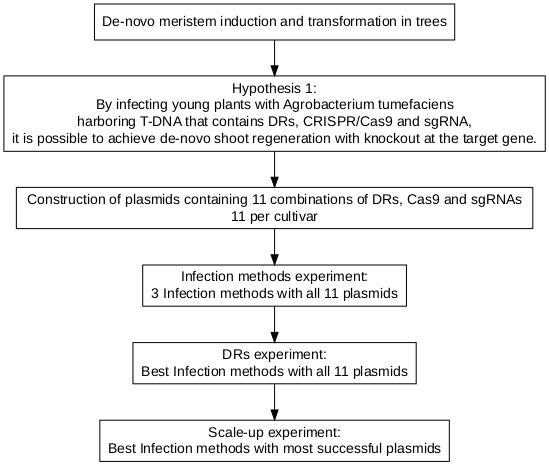

\pagenumbering{gobble}

\begin{center}
   \textbf{\large Under the supervision of\\
                      Dr. Amir Raz\\
                  Prof. Martin Goldway}
\end{center}

\vspace{\fill}

Signature of student:_______________Date:____/____/_______ \hfill \break \newline Signature of supervisor:_______________Date:____/____/_______\hfill \break \newline Signature of supervisor:_______________Date:____/____/_______ \hfill \break \newline Signature of chairperson for graduate studies:_______________Date:____/____/_______

\begin{titlepage}
   \begin{center}
       
        \includegraphics[width=0.5\textwidth]{telhai logo.jpg}
        
        \vspace{0.5cm}

       \textbf{\Huge THE FACULTY OF SCIENCES\\ MASTER IN BIOTECHNOLOGY}

       \vspace{2cm}
       \textbf{\huge Developing novel methods for gene editing in trees}
            
       \vspace{3cm}

       \textbf{\Large Ben Sivan}
       
        \vspace{1cm}

       \textbf{\large Under the supervision of\\
       Dr. Amir Raz\\
       Prof. Martin Goldway}
       
       \vspace{1cm}

       \textbf{\large Thesis submitted in partial fulfillment of the requirements for the master of science degree in biotechnology}
       
       \vfill
     
       Department of Biotechnology\\
       Tel-Hai collage\\
       Israel\\
       October 2021
            
   \end{center}
\end{titlepage}

\newpage

# Acknowledgements
I wish to thank MIGAL research instetute for the welcoming work environment. To Prof. Rachel Amir as the head of the master program for the guidance in the writing process. To the Flaishman's group for their collaboration in the research. To all the Lab members, who helped me in my journey. Great appreciation to my supervisors Prof. Martin Goldway and Dr. Amir Raz for all their support, advice and over all creative freedom to make this work truly my own. Last but not list, to my wife Neta, for her understanding even through pregnancy and labor.

\newpage

\setcounter{tocdepth}{3}
\tableofcontents
\newpage

\listoffigures
\newpage

\listoftables
\newpage

\pagenumbering{arabic} 
\setcounter{page}{7}

```{r setup, include=FALSE}
knitr::opts_chunk$set(echo = TRUE, fig.pos= "H")
```

```{r library, echo=FALSE, message=FALSE, warning=FALSE, results='asis'}
library(knitr)
library(kableExtra)
library(tidyverse)
library(ggpubr)
library(latex2exp)
```

# Abstract

Global environmental changes challenge food security. In comparison to most crops, trees are resilient to temperature fluctuations and consequently offer some protection for sufficient and nutritious food. Crop improvement with available methods reaches an acknowledged barriers and genetic modification can contribute substantially to breakthroughs. Tissue culture is a required step in most genetic modification methods. Yet, it is far from being routine in most laboratories. In trees, because of long generation time, tissue culture issues become much more pronounced. In this project we are attempting to implement a novel gene editing method for trees that combines eather de-novo meristem induction or systemic gRNA propagation through viral infection, hence will not require tissue culture transformation. In this work we used _Agrobacterium tumefaciens_ as the vector for in-planta transformation. I used apples as a commercial fruit tree crop and poplar as a model system for trees. I applied a few development regulators, and a different agroinfiltration strategis. In addition I analyzed tissue specific transcriptome to further understand gene expression patterns in tissue development, and scan for better normalizer genes for real-time quantitative PCR. I showed that over expression of the gene combination _WUS2_-_STM_ and _WOX11_-_STM_ were successful in invoking de-novo shoot regeneration in a young apple plants, in-planta and found, based on the tissue specific transcriptome, that in poplar the transcription factor _WOX1_ from the WUSCHEL family is most specific to shoot. 

# Introduction

## Trees and their vital role as source for food security

Food security is a fundamental necessity that challenged mankind throughout its history. Many researchers estimate that food security is under threat as a result of global environmental changes through land degradation, loss of biodiversity, changes in hydrology, and changes in climate patterns[@Ericksen2009]. Moreover population growth is around 100 million per year. Since the early 1990s, the number of extreme weather-related disasters has doubled[@FAO2020a]. Higher temperatures, water scarcity, extreme events like droughts and floods have already begun to impact staple crops around the world[@Linden2015] and have reduced the yields of major crops like maize and wheat[@Rosenzweig2001]. According to the Food and Agriculture Organization of the United Nations, the climate variability has an impact of at least 80% to the unpredictable reduction in yield of cereal crops in semi-arid regions of the world such as the Sahel region of Africa[@Shiferaw2014].

Fruit trees contribute in many ways to improving diets and combating hunger around the world[@Vinceti2013]. Trees are much more resilient to extreme weather-related disasters in comparison to most crops, and consequently they can offer some insurance for sufficient and nutritious food during times of seasonal food shortages due to droughts, floods and hot or cold waves. This is the main reason behind the evergreen agriculture approach[@Garrity2010]. Trees resilient is due to their being perennial woody plants, which allows them to grow strong, with durable trunk and long roots. In addition, fruit trees are able to produce large yield on a given area resulting from  their vertical growth. However, tree research has a drawback among them a long generation period of a few years.

## Classical plant improvement methods for trees on a human time scale

Since mankind developed the ability to grow plants for food, methods were developed to improve yield. The most ancient method is the selection and propagation of plants with preferred traits such as larger seeds. This method creates an artificial selection pressure for desirable trait. However, this process is dependent on random mutations, making it slow.

Towards the end of the 19th century plant breeding was established. Breeding at its core is based on the idea of merging traits from different lines to a single cultivar through crossbreeding. Although this method is faster, this process takes many generations and even in annual plants takes a few years. Moreover, in trees breeding is much slower and therefore new varieties are the outcome of a single generation of selection. Still, impressive results have been obtained that have contributed significantly to human's diet.

## Genetic modification as a viable solution for trees improvement

With the understanding that the inherited genetic material is DNA, the ability was developed to utilize the acceleration of random mutations as a way of gaining genetic diversity and selecting based on the phenotypic outcome. By exposing seeds to chemicals or radiation the frequency of mutation events is increased with some of them providing desirable traits.  

As a result of the genetic revolution, many genetic modification technologies were developed, some of them relevant for plants too. Those methods are more direct in their approach to manipulate DNA for an expected outcome. They can be divided into two groups, exogenous DNA delivery methods and site-specific endonucleases. 

## Exogenous DNA delivery methods  
  
Techniques developed for the introduction of foreign DNA genes (exogenous) into a cell.

### Biolistic particle delivery system or Gene gun  

Gene gun or biolistic particle delivery system is a device used to deliver exogenous DNA (transgenes), RNA, or protein to cells. By coating particles of a heavy metal with a gene of interest and firing these micro-projectiles into cells using mechanical force, an integration of desired genetic information can be induced into cells[@OBrien2011]. Thus the DNA may be transformed into whatever genomes are present in the cell, either nuclear, mitochondrial, plasmid or any others, in any combination. Targeting the specific DNA requires particular construct design. The integration of multiple templates of the DNA construct may occur, resulting in variable copy numbers of the iserted gene and variable expression levels[@Shewry2008149].

### Protoplast transformation  
  
Protoplast refers to the entire cell excluding the cell wall. Protoplasts can be generated by stripping the cell wall from plant, bacterial, or fungal cells by mechanical, chemical or enzymatic means[@davey2005plant]. The advantages of using protoplast in comparison to a whole cell is the direct access to the cells membrane which result in increase uptake of DNA and increase transformation frequency. Treatment of protoplast-plasmid mixtures with PEG and/or electroporation is the approach normally exploited to induce DNA into protoplasts. However, transformation frequencies typically remain low (ca. one in 104 protoplasts giving stably transformed tissues)[@davey2005plant]. Heat shock treatment and irradiation of recipient protoplasts enhance transformation frequency, probably by increasing the recombination of genomic DNA with incoming foreign DNA, or the initiation of repair mechanisms that favor DNA integration. Carrier DNA and the nature of the plant genome also affect transformation[@davey2005plant]. DNA uptake into protoplasts has been especially important in transforming plants that are not amenable to other methods of gene delivery, particularly agrobacterium-mediated transformation. Many of such studies focused on cereals, particularly rice, once protoplast-to-plant systems became available for these crops[@Rakoczy-Trojanowska2002]. However, protoplast regeneration into mature plants is hard to achieve in most plants, which is the major holdback of this approach.

### Agrobacterium-mediated transformation  
  
Agrobacterium is a genus of Gram-negative bacteria that uses horizontal gene transfer to cause tumors in plants. _Agrobacterium tumefaciens_ is the most commonly studied species in this genus. Agrobacterium is well known for its ability to transfer DNA between itself and plants, and for this reason it has become an important tool for genetic engineering. The ability of Agrobacterium to transfer genes to plants and fungi is used in biotechnology, in particular, genetic engineering for plant improvement. Genomes of plants can be engineered by use of Agrobacterium for the delivery of sequences hosted in transfer of a DNA segment (T-DNA) binary vector. The essential parts of the T-DNA are its two small (25 base pair) border repeats, at least one of which is needed for plant transformation. The genes to be introduced into the plant are cloned into a plant binary vector that contains the T-DNA region, together with a selectable marker (such as antibiotic resistance) to enable selection for plants that have been successfully transformed. Plants are grown on media containing antibiotics following transformation, and those that do not have the T-DNA integrated into their genome will die[@Mukeshimana2013]. The most common methodology for introducing Agrobacterium to plant tissues is in liquid suspension of sectors of somatic tissue (explant), then co-culture on agar medium in the dark. Another method is Agroinfiltration, used to induce transient expression of genes in a plant. Agroinfiltration is performed by direct injection or by vacuum infiltration of suspended _Agrobacterium tumefaciens_ into a plant leaf. The main benefit of agroinfiltration when compared to the more traditional plant transformation is speed and convenience, although yields of the recombinant protein in traditional methods are generally higher and more consistent[@Undervisningsministeriet2014]. Floral dipping is another method that allows efficient plant agrobacterium-mediated transformation without need for tissue culture[@Zhang2006]. 

### Virus as a DNA delivery vector

Virus mediated gene delivery utilizes the ability of a virus to inject their genetic material into a host cell and takes advantage of the virus's ability to hijack the cells machinery for replication and integration to the genome. This method has been used to deliver Small interfering RNAs (siRNAs) in order to silence a certain gene and hence it is called Virus-Induced Gene Silencing.

### Virus-Induced Gene Silencing (VIGS)

Virus-induced gene silencing is one of the reverse genetics tools for analysis of gene function that uses viral vectors carrying a target gene fragment to reduce double-strand RNA (dsRNA) which trigger RNA mediated gene silencing. Small interfering RNAs (siRNAs) which are 21-25 nucleotide long, guides specific cleavage or suppression of target messenger RNA (mRNA) at posttranscriptional level. The process takes place as follows, siRNAs which are processed from long double-stranded RNAs (dsRNA) by DICER, an RNAse-like enzyme, are then incorporated into RNA-induced silencing complex (RISC). This complex with siRNA targets specific mRNA transcripts having sequence complementarity with the specific siRNA. In other words, the antisense strand of the siRNA associates with the RNAi silencing complex (RISC) to target homologous RNA for degradation. Some virus species were previously modified and used for silencing the gene of interest[@Jiang2014]. Tobacco mosaic virus (TMV) is the first modified virus for application of VIGS methods to plants. TMV was used for effective PDS gene silencing in **Nicotiana benthamiana** plants[@Harries2008]. Tobacco rattle virus (TRV) was also modified to be a tool for gene silencing in plants and lately barley stripe mosaic virus (BSMV) was developed for efficient silencing of pds gene in barley[@fire1998potent].

## Site-specific endonucleases

Site-specific endonucleases are enzymes that are capable of dissecting nucleic acid strands such as DNA or RNA at a specific target sequence. In contrast to restriction enzymes, this sequence can be engineered and hold longer sequences which increase it's specificity.

### Zinc Finger Nucleases (ZFNs)   
  
A zinc finger is a small protein structural motif that is characterized by the coordination of one or more zinc ions (Zn2+) in order to stabilize the fold. The ability to engineer zinc fingers to have an affinity for a specific sequence of DNA, made them suitable for important applications such as zinc finger nucleases and zinc finger transcription factors. While significant progress has been made in ZFNs engineering capability, a barrier to their widespread adoption has been the challenge in engineering new DNA binding specificities[@Chandrasegaran1996].

### Transcription Activator-like Effector Nucleases (TALENs)  
  
Transcription activator-like effector nucleases are restriction enzymes that can be engineered to cut specific sequences of DNA. They are made by fusing a TAL effector DNA-binding domain to a DNA cleavage domain (a nuclease which cuts DNA strands). The simple relationship between amino acid sequence and DNA recognition of the TALE binding domain allows for the efficient engineering of proteins. That said, the failure of some custom TALENs suggests that yet unknown rules govern the assembly of functional repeat domains. For example, repeat composition may influence protein stability[@Christian2010].

### Clustered Regularly Interspaced Short Palindromic Repeat (CRISPR) 
  
CRISPR systems are part of the adaptive immune system of bacteria and archaea, protecting them from invading viruses by cleaving their DNA in a sequence-dependent manner. The immunity is acquired by the integration of short fragments of the invading DNA known as spacers between two adjacent repeats at the proximal end of a CRISPR locus. The CRISPR arrays, including the spacers, are transcribed during subsequent encounters with invasive DNA and are processed into small interfering CRISPR RNAs (crRNAs) approximately 40 nt in length, which combine with the transactivating CRISPR RNA (tracrRNA) to activate and guide the CRISPR Assosiated 9 (Cas9) nuclease[@Barrangou1709]. A prerequisite for cleavage is the presence of a conserved protospacer-adjacent motif (PAM) downstream of the target DNA, which usually has the sequence 5'-NGG-3'[@GasiunasE2579]. Jinek et al., re-engineered the Cas9 endonuclease into a more manageable two-component system by fusing the two RNA molecules into a "single-guide RNA"(sgRNA) that, when combined with Cas9, could find and cut the DNA target specified by the guide RNA. By manipulating the nucleotide sequence of the guide RNA, the artificial Cas9 system could be programmed to target any DNA sequence for cleavage[@Jinek2012]. The Nobel Prize in Chemistry 2020 was awarded to Emmanuelle Charpentier and Jennifer A. Doudna for the development of the CRISPR/Cas9 enzyme as a genetic editing tool.

## Genetic Editing bottleneck

Bottlenecks need to be overcome before the full potential of this technology may be achieved in plants. Plants are distinguished from most complex eukaryotes in the totipotency of their tissues[@Indra1972]. This has allowed researchers to convert explant into a whole plant, with the use aseptic tissue culture growth medium. This somatic-germinal conversion (or regeneration) is the foundation of most plant transformation approaches. Transgenes are delivered to isolated somatic tissue followed by selection for the transgene and regeneration of the modified tissue into a whole, transgenic plant[@Rasmussen2017]. Success is often genotype dependent because specific growth medium need to be tuned for each new plant and the regenerated plants can have changes to their genome and epigenome[@Kaeppler2000]. In trees, because of long generation time, the issues of maintaining aseptic environment and assessing growth medium suitability become much more pronounced.

Crop production globally is improving, but this trend seems to approach a plateau (Figure \ref{fig:agricultural area per capita}). Hence substantial changes in methods for agronomic processes and crop improvement are required[@TesterMarkandLangridge2010]. 

```{r agricultural area per capita, echo=FALSE, message=FALSE, warning=FALSE, fig.pos="H", out.width = "70%", fig.align="center", fig.cap="Agricultural area per capita world-wide in hectare/person. \\newline{} \\textbf{Line.} Average area \\textbf{Ribbon.} Maximum and minimum values  \\newline{} https://ourworldindata.org/"}

agricultural_area_per_capita_summary <- read.csv("Tables/agricultural_area_per_capita_summary.csv")

agricultural_area_per_capita_summary_fig = agricultural_area_per_capita_summary %>% ggplot(aes(x = Year)) + geom_ribbon(aes(ymin=Min, ymax=Max), fill = "grey70") + geom_line(aes(y = Avg)) + ylab("hactare/person") + theme_classic()

agricultural_area_per_capita_summary_fig
```


## Advance genetic Editing technologies

Tissue culture in the context of plant transformation is designed to allow the capture of rare cell-transformed events. This is done by providing a supportive environment for the explant, so that it exposes as much as possible inner cells of the plant to the genetic manipulation and later allow for regeneration and differentiation to a new plant. For the most part, the regeneration begins with differentiation to a shoot meristem, and then to a full shoot. The common way to induce the explant for meristem differentiation and shoot formation is with the use of plant hormones. The drawback of using hormones is the precise application needed and the broad spectrum of effects it have on the tissue such as epigenetic changes. In order to mitigate those drawbacks, researchers tried to induce regeneration by switching on specific genetic pathways with induced developmental regulators (DRs) transcription factors. It has been shown that by over expressing of some of the DRs in the cell it was possible to differentiate the cells in a more precise manner, similar to the work on induced pluripotent stem cells in humans[@Sang2018]. Other works have mitigated other drawbacks of tissue culture like precise growth medium and aseptic environment by utilizing the plant own environment to create a controlled micro environment in-planta. Lately Zhang et al. showed in pomelo, where the transformation took place in a close environment around an incision on soil grown plant, with the use of antibiotics as selection and hormones for development induction[@Zhang2017]. This method is revolutionary since the transformed tissue is attached to the plant, hence it is much less susceptible to contaminations and most of its micronutrients can come from the neighboring tissues.

### De-novo meristem induction and transformation

Maher et al.[@Maher2020] introduced the next step towards independence from tissue culture by combining the two approaches of in-planta transformation and de-novo meristem induction. In this method developmental regulators (DRs), CRISPR/Cas9 and sgRNA are delivered to somatic cells of whole plants through Agroinfiltration. This induces meristems that produce shoots solely in cells that were infected successfully with T-DNA bearing CRISPR/Cas9 and sgRNA.

Examples of developmental regulators (DRs):

-   Wuschel2 (_WUS2_) from _Zea mays_ (Maize) is a transcription factor that plays a central role during early embryogenesis, organogenesis and flowering, probably by regulating expression of specific genes. Required to specify stem cell identity in meristems, such as shoot apical meristem (SAM)[@Maher2020].

-   Shoot meristemless (_STM_) from _Arabidopsis thaliana_, appears to keep central meristem cells undifferentiated, thus
playing a major role in maintaining shoot and floral meristems[@Maher2020].

-   Isopentenyl transferase (_IPT_) from the Ti-plasmid of _Agrobacterium tumefaciens_ is a key enzyme in cytokine biosynthesis[@Maher2020].

-   Wuschel-related homeobox 11 (_WOX11_) from _Populus trichocarpa_ (Poplar tree) acts as a master regulator conducting the expression of key  transcription factors to induce de novo shoot organogenesis in poplar[@Liu2018a].

DRs have a long history in plant development research and in recent years are utilized in transformation methods. WUSCHEL is the most known DR that is involved in the meristem cell identity. Several more DRs were identified in their capability to induce cell potency like the tumor induced gene IPT from _Agrobacterium tumefaciens_. Novel methods for the identification of new tissue specific transcription factors and their goal as a DRs in the cell became possible and commonly used, such as tissue specific transcriptome.

### Virus-Induced Gene Editing (VIGE)

VIGE is another example of an in-planta transformation method with a very different strategy in comparison to the former. It strives to achieve systemic gene editing in order to spare the hurdle of regeneration. It has been demonstrated that the CRISPR/Cas system is able to achieve efficient gene editing in plants through either transient expression or transgenic plants. In order to bypasses the requirement for transformation and/or regeneration, Ali et al.(2015) developed a virus-mediated genome editing system by separating the two component Cas9 endonuclease and sgRNA. First, a Cas9 overexpressing (Cas9-OE) transgenic plant was generated through Agrobacterium-mediated transformation. Then, modified vector propagates through the plant similar to the VIGS process and edited the target gene. Typically, VIGE approach results in low frequencies of gene editing in somatic cells, and recovery of mutant progeny is rare. Plant phloem exudates contain many transfer RNA-like sequences capable of cell-to-cell movement termed mobile RNA sequences[@zhang2016trna]. To overcome VIGE setbacks, researches from the Voytas lab. fused the mobile RNA sequences, Flowering LocusT (FT) and tRNAs, to the 3'-end of the sgRNA to gain better access to the germline[@Ellison2020]. FT is transcribed in leaf vascular tissue and then transports to the shoot apical meristem to induce flowering. Their results suggests that RNA mobility sequences increase overall virus accumulation which, in turn, results in higher frequencies of heritable gene editing. 
    
## Poplar as a model organism for trees

*Populus* is a model system for some aspects of tree research for several reasons: It has a rapid growth rate compared to other trees, it is easy to propagate and transform and it has a relatively small genome [@Taylor2002], 45 time smaller than that of pine tree. The target gene that we chose for poplar was Phytoene desaturase (PDS), because it has been used in many cases as a reporter for gene editing. The PDS gene encodes an enzymes in the carotenoid biosynthesis pathway and PDS knockout results in susceptibility to photobleaching of the chloroplasts, which in turn results in albino and dwarf phenotype.

## The S-RNase gene that governs the self-incompatibility fertilization system in apples

Apple (_Malus domestica_) trees are one of the most widely grown fruit tree in the world with an annual yield of 70 million tons (FAOSTAT). In this study, apple plants were used for the transformation method. As a member of the Roseaceae plant family it carries the Self-incompatibility (SI) fertilization system. SI is a complex system, one out of several mechanisms that prevent plants from self-fertilizing mainly by rejection of the male gametophyte to maintain high genetic variability. Plants have evolved two distinct SI systems, the sporophytic (SSI) and the gametophytic (GSI) systems. In Apple, the GSI system is governed by the RNases (termed S-RNases), which is produced in the style and penetrate the pollen tube. The penetration of S-RNase into the pollen tube triggering a series of responses involving membrane proteins that inhibits the pollen-tube's growth process [@DelDuca2019]. Inactivation of S-RNase results in self-compatibility plants [@goldway2012self] hence preventing the need of cross pollination and allowing orchards of a single cultivar in contrast to SI cultivars that requires cross pollination and at least two cultivars that pollinate each other. However, up to date non of the apple cultivar are self-compatible and therefore we chose S-RNase as the target for gene editing.

## Hypotheses

1. By infecting young plants with _Agrobacterium tumefaciens_ harboring T-DNA that contains DRs, CRISPR/Cas9 and sgRNA, it is possible to achieve de-novo shoot regeneration with knockout at the target gene.

2. By infecting Cas9-OE plants with viral vector bearing sgRNA targeting endogenous gene, a tissue containing a knocked-out targeted gene will be obtained.

## Goal

* To develop a new method for in-planta tree transformation and gene editing.

## Milstones

### Meristem induction and transformation 

* Contraction of vectors with mix of DRs for shoot regeneration examination.

* Achieve de-novo shoot regeneration as a result of the agro-infiltration.

* Observe mutation in the target sequence. 

### VIGE

* Generation of a Cas9-OE poplar plant using Agrobacterium-mediated transformation.

* Contraction of viral vectors with sgRNA.

* Contraction of viral vectors with sgRNA fused with mobile RNA sequence.

* Observation of virus propagation.

* Observation of mutations at the target sequence.


#  Materials and methods

## Plant matirial 

_Populus Alba-Tremula_ (PopAT) cultivar, which were reproduced by vegetative reproduction in tissue culture (Table \ref{tab:Poplar mediums}).   
_Malus domestica_ (apple) cultivars, and apple seeds that were extracted from fruits.

```{r Poplar mediums, echo=FALSE}

Components = c("","","MS","Sucrose","Agar","NAA","BAP","IBA","Kanamycin","Cefotaxime","Timentin","pH")
M1 = c("(Plant Propagation","and Pre-Culture)","4.43 g/L","30 g/L","5.8 g/L","","","","","","","5.8")
M2 = c("(Co-Culture)","","4.43 g/L","30 g/L","5.8 g/L","0.05 mg/L","0.5 mg/L","","","","","5.8")
M3 = c("(Shoot Induction)","","4.43 g/L","30 g/L","5.8 g/L","0.05 mg/L","0.5 mg/L","","30 mg/L","200 mg/L","200 mg/L","5.8")
M4 = c("(Root Induction)","","2.215 g/L","30 g/L","5.8 g/L","0.02 mg/L","","0.05 mg/L","30 mg/L","200 mg/L","200 mg/L","5.8")


mediums = data.frame(Components = Components, M1 = M1, M2 = M2, M3 = M3, M4 = M4)

sep = c(rep('',length(Components)))                             
kable(mediums, caption = "Composition of media for cultivation, tranformation, selection and regenetarion of hybrid poplar P.alba X P.glandulosa",booktabs = TRUE, align = "ccccc", linesep = sep) %>% kable_styling(latex_options = "HOLD_position")
```
## Matirials

* [Petri-dish](https://shop.gbo.com/en/row/products/bioscience/microbiology-bacteriology/dishes/petri-dishes/) (Greiner Bio-One™)
* [Magenta™ vessel](https://www.sigmaaldrich.com/IL/en/substance/magentavessel1234598765)
* PARAFILM® (Sigma-Aldrich™)
* [Lysogeny broth](https://www.formedium.com/product/lb-broth-lennox/) (LB from ForMedium™)
* [Agar](https://www.formedium.com/product/agar/)
* Murashige & Skoog (MS from Sigma-Aldrich™)
* [CTAB](https://www.sigmaaldrich.com/catalog/product/sigma/h6269?lang=en&region=IL) (Sigma-Aldrich™)
* [TRI reagent®](https://www.sigmaaldrich.com/IL/en/technical-documents/protocol/protein-biology/protein-lysis-and-extraction/tri-reagent?gclid=CjwKCAiA_omPBhBBEiwAcg7smZ6kLByCZQUwUDAqDPPMJG-_DgYEHC8fwC_oR83txhumwBdGseVw9BoCBpsQAvD_BwE) (Sigma-Aldrich™)
* Acetosyringone (Sigma-Aldrich™)

### antibiotics

* Ampicillin (Sigma-Aldrich™)
* Kanamycin (Sigma-Aldrich™)
* Rifampicin (Sigma-Aldrich™)
* Gentamicin (Sigma-Aldrich™)
* Spectinomycin (Sigma-Aldrich™)

### Kits

[Miniplsmid putification kit](https://www.geneaid.com/product.php?act=view&id=180) (Presto™)

### Instruments

* [MicroPulser Electroporator by Bio-Rad](https://www.bio-rad.com/en-il/product/micropulser-electroporator?ID=83527990-34fb-4b33-b955-ca53b57bf8b9)
* [Microcentrifuge](https://www.thermofisher.com/order/catalog/product/69720#/69720) (Pierce™)
* PCR machine [Biometra TRIO](https://www.analytik-jena.com/products/life-science/pcr-qpcr-thermal-cycler/thermal-cycler-pcr/biometra-trio-series/)
* Power supply + Electrophoresis bath ([PowerPac™ Basic Power Supply](https://www.bio-rad.com/en-il/product/powerpac-basic-power-supply?ID=bea5dea1-cef0-43ad-8af5-b2c0287f6e07), [Wide Mini ReadySub-Cell GT Horizontal Electrophoresis System](https://www.bio-rad.com/en-il/sku/1704489-wide-mini-readysub-cell-gt-horizontal-electrophoresis-system-for-precast-gels?ID=1704489))
* UV-light table [($UV_{DOC}$ HD2 by Uvitec Cambridge)](https://topac.com/documents/geldoc_%20catalogue.pdf)

## Protocols

[**Gibson Assembly Cloning**](https://www.addgene.org/protocols/gibson-assembly/) [@Gibson2009]: In 2009 Dr. Daniel Gibson and colleagues at the J. Craig Venter Institute developed a novel method for the easy assembly of multiple linear DNA fragments. Regardless of fragment length or end compatibility, multiple overlapping DNA fragments can be joined in a single isothermal reaction. With the activities of three different enzymes, the product of a Gibson Assembly is a fully ligated double-stranded DNA molecule. The reaction is carried out under isothermal conditions using three enzymatic activities: a 5' exonuclease generates long overhangs, a polymerase fills in the gaps of the annealed single strand regions, and a DNA ligase seals the nicks of the annealed and filled-in gaps.

[**Golden-Gate cloning**](https://blog.addgene.org/plasmids-101-golden-gate-cloning)[@Cermak2017]: Golden Gate cloning technology relies on Type IIS restriction enzymes, first discovered in 1996. Type IIS restriction enzymes are unique from "traditional" restriction enzymes in that they cleave outside of their recognition sequence, creating four base flanking overhangs. Since these overhangs are not part of the recognition sequence, they can be customized to direct assembly of DNA fragments. When designed correctly, the recognition sites do not appear in the final construct, allowing for precise, scarless cloning. The clonning system is designed on several plasmids, the backbone plasmid plus few modules. Each module can be assembled with different insert to create a modular clonning system. A 4 module system is consists of backbone and module A, B, C and D. By assembling the same module with different inserts, it is possible to assemble complex cassette with combination genes.  

[**Gel agarose for DNA electrophoresis**](http://schepartzlab.yale.edu/intranet/protocols/AgaroseGelElectrophores.pdf) [@Lee2012]: Seperation of DNA fragments based on size through the migration in agarose gel powered by electric field. LE multi-purpose agarose is dissolved into a TAE Buffer, Usually 1-2%, than added Ethidium bromide solution for DNA detection under UV light and pured into a gel mold (Tray + Comb). After the gel polymerizes, the comb can be removed, and the Samples are loaded to the created wells including DNA ladder. Setting the voltage at ~110 V for 30 minutes or untill sufficient seperation is obtained. Image the gel under UV light for fragment analysis.

**E.coli Heat-shock competent preperation and** [**transformation**](https://www.addgene.org/protocols/bacterial-transformation/)[@Chang2017]: E.Coli bacteria is prepered for heat shock transformation by growing a 50 ml starter to 0.5-1 $OD_{600}$ and then palleting the cells by centrifuge for 10 min at 5000 rmp in $4^oC$. Next the supernated is disarded and the cell are resuspended in 0.5 ml ice cold 20 mM $CaCl_2$ + 15% glycerol. 100 $\mu l$ aliquot are then frozen directly in liquid nitrogen and stored in $-80^oC$ freezer. For transformation, the cells are thaw on ice and then added 50 ng of circular DNA. Incubate on ice for 20 min. Put tubes water bath at $42^oC$ for 1.5 min and then return them back to the ice for 5 minutes to reduce damage to the E.coli cells. Add 1 ml of LB (with no antibiotic added). Incubate tubes for 1 hour at $37^oC$. (Can incubate tubes for 30 minutes, unless trying to grow DNA for ligation which is more sensitive. For ligation, leave tubes for 1 hour). Spread about 100 $\mu l$ of the resulting culture on LB plates (with appropriate antibiotic added) and Grow overnight. Pick colonies about 12-16 hours later.

**Plasmid DNA extraction and purification** was preformed with [Presto™ Mini Plasmid Kit](https://www.hylabs.co.il/products/presto-mini-plasmid-kit/).

**DNA extraction** from plant tissue was performed by the common CTAB method[@Porebski1997]: Grind ~200 mg of plant tissue to a fine paste and add 700 $\mu l$ CTAB buffer pre-heated to $65^oC$ + 7$\mu l$ 2-Mercaptoethanol. Incubation at $65^oC$ for 30 min and Vortex few times. Chill on ice and add 700ul Chloroform octanol (1:24). Vortex and centrifuge 5 min 14,000 rpm. Transfer the upper aqueous phase only (contains the DNA) to a clean tube (~550-600 $\mu l$). Add 400 $\mu l$ Chloroform octanol (1:24) and centrifuge 5 min 14,000 rpm. Transfer the upper aqueous phase only (contains the DNA) to a clean tube (~350 $\mu l$) and add 35 $\mu l$ Sodium acetate (NaOAc) or 10% of sample volume and 875 $\mu l$ 100% Ethanol (X2.5 sample volume). Incubate at $-80^oC$ for Hour/over night. Centrifuge 10 min 10,000 rpm and remove the supernatant. Add 1 ml 70% Ethanol and centrifuge 10 min 10,000 rpm. Remove the supernatant air dry the pellet, invert on paper towel. Resuspend the DNA in 50 $\mu l$ sterile DNase free water

**RNA extraction** from plant tissue was performed by the common TRI reagent® protocol [@Chomczynski1993]: Grind plant tissue to a fine paste with TRI Reagent (1 ml per 50-100 mg of tissue) and incubation 5 minutes at room temperature. Next add 200 $\mu l$ chloroform per ml of TRI Reagent. Vortex and Incubation 2-15 minutes at room temperature. Centrifuge the resulting mixture at 12,000 g for 15 minutes at $2-8^oC$ and transfer the aqueous phase to a fresh tube. Add 0.5 ml of 2-propanol per ml of TRI Reagent and mix gently. Incubation for 5-10 minutes at room temperature. Centrifuge at 12,000 g for 10 minutes at $2-8^oC$ and discard the supernatant. Add 1 ml of 75% ethanol per 1 ml of TRI Reagent. Vortex and centrifuge at 7,500 g for 5 minutes at $2-8^oC$. Discard the supernatant air dry the RNA pellet for 5-10 minutes. Last, resuspend the RNA pellet with ~30 $\mu l$ of RNase free water.

**Plantlets transformation**: This is the protocol used for on apple plantles that produce the most de-novo shoot regeneration frequency.   
Grow EHA-105 agrobacterium with T-DNA on petri-dish for 4 days. Pick the whole plate with a Drigalski spatula into a new tube and Elute in transformation medium 2 $\mu l$ per mg bacteria. Take a 3-4 weeks old apple plantles and Cut the stem above the first new leafs (as far as posible from the axillary buds). Inject the bacteria into the stem cut and cover with parafilm for 1-2 weeks.


# Experimants scheme


```{r Experimants scheme, echo=FALSE, message=FALSE, warning=FALSE}
library(DiagrammeR)
library(DiagrammeRsvg)  # for conversion to svg
library(rsvg)  # for saving svg

FlowChart <- 
  grViz(diagram = "digraph flowchart {
    node [fontname = arial, shape = rect];
    edge [fontname = arial];

    title [label = 'De-novo meristem induction and transformation in trees']

    hypothesis [label = 'Hypothesis 1: \nBy infecting young plants with Agrobacterium tumefaciens \nharboring T-DNA that contains DRs, CRISPR/Cas9 and sgRNA, \nit is possible to achieve de-novo shoot regeneration with knockout at the target gene.']

    plasmids [label = 'Construction of plasmids containing 11 combinations of DRs, Cas9 and sgRNAs \n11 per cultivar']

    infection_methods [label = 'Infection methods experiment:\n3 Infection methods with all 11 plasmids']

    DRs [label = 'DRs experiment:\nBest Infection methods with all 11 plasmids']

    ScaleUp [label = 'Scale-up experiment:\nBest Infection methods with most successful plasmids']
    
    title -> hypothesis -> plasmids -> infection_methods -> DRs -> ScaleUp;
  }")
  
tmp <- capture.output(rsvg_png(charToRaw(export_svg(FlowChart)),'De-novo_meristem_induction_FlowChart.png'))

FlowChart <- 
  grViz(diagram = "digraph flowchart {
    node [fontname = arial, shape = rect];
    edge [fontname = arial];

    title [label = 'Virus induced gene editing in trees']

    hypothesis [label = 'Hypothesis 2: \nBy infecting Cas9-OE plants with viral vector bearing sgRNA targeting endogenous gene, \na tissue containing a knocked-out targeted gene will be obtained.']

    plants [label = 'Generating Cas9-OE tree']

    vectors [label = 'Generating a viral vector bearing sgRNA targeting endogenous gene']

    NB_infection [label = 'Propagating GM-vector in Nicotiana Benthamiana']

    plant_infection [label = 'Infecting Cas9-OE tree with GM-vector']
    
    title -> hypothesis -> plants -> vectors -> NB_infection -> plant_infection;
  }")
  
tmp <- capture.output(rsvg_png(charToRaw(export_svg(FlowChart)),'VIGE_FlowChart.png'))
```
```{r De-novo_meristem_induction_FlowChart, out.width = "80%", fig.align="center", echo=FALSE, fig.cap="De-novo meristem induction experimants scheme"}
 
```
```{r VIGE_FlowChart, out.width = "80%", fig.align="center", echo=FALSE, fig.cap="VIGE experimants scheme"}
include_graphics("VIGE_FlowChart.png") 
```

## Implementing VIGE in trees

### Generating Cas9-OE poplar plant

Based on protocol developed by Song et al.[@Song2019] with minor changes.

Top10 bacteria with $3\Omega1$-NPT-ubi::Cas9 plasmid were grown in LB liquid-medium containing 50 mg/L Spectinomycin, at 200rpm over-night at $37^oC$. The following day the plasmids were extracted using miniplsmid putification kit. Then the plasmid were introduced into EHA-105 agrobacterium using electropuration and plated on LB-agar medium containing 50 mg/L Spectinomycin and 50 mg/L Gentamicin, at $28^oC$ for two days. A single colony was picked to LB liquid-medium containing 50 mg/L Spectinomycin and 50 mg/L Gentamicin and incubated with shaking 200rpm over-night at $28^oC$. The cells were then harvested by centrifuge at 5000 rpm for 10 min and resuspended with 1/2 MS solution (pH 5.8 to 6.0) containing 5% (w/v) sucrose and acetosyringone (100 µM) as the transformation solution, to a culture density of 0.6 $OD_{600}$. 

The leaf explants for transformation were prepared from 3-week-old plantlets that were cut perpendicular to main veins and laid on M1 for 2 days. Next the cut leaves were incubated with the suspended agrobacterium for 15 min with slow shaking every 5 min and then blotted with sterile filter paper to remove the excess bacteria and cultured on M2 in dark conditions for 3 days.

The co-cultivated leaves were washed twice in sterilized distilled water for 5 min, blotted with sterile filter paper to remove the excess water and transferred to M3 for 10 days. After 4 weeks 1 to 2 cm shoots were cut off and transferred to M4 For obtaining plants. The transgenic poplar plants were transferred to M1 for 3 weeks to avoid agrobacterium contamination.

### Generating a viral vector bearing sgRNA targeting PDS endogenes fused with mobile RNA sequence and GFP.

Following Lee et al.[@Lee2015] with minor changes.

- Cunstraction of plasmids containing virus genome segments.
Viruses genome partitions: The last partite is programmable, for the insertion of sgRNA.

BSMV:\
- pCaBSMV-$\alpha$\
- pCaBSMV-$\beta$\
- pCaBSMV-$\gamma$::PDS.gRNA\

TRV:\
- pRNA1\
- pRNA2.PEBV::PDS.gRNA\

The TRV2 and $\gamma$ partites were cloned with sgRNA via ligation independent cloning (LIC). GV-3101 agrobacterium was transformed using electropuration and grown on petri-plate with LB-agar medium containing 50 mg/L kanamycin and 10 mg/L Gentamicin, at $28^oC$ for two days. A single colony was picked to LB liquid-medium containing 50 mg/L kanamycin and 10 mg/L Gentamicin, and incubated with shaking 200rpm over-night at $28^oC$. Cells were collected by centrifuge for 10min in 4500rpm, and re-suspended in infiltration buffer(1/4 MS with 1% sucrose, 100 $\mu M$ and 0.01% Silwet L-77) to $OD_{600}$ of 0.5.

PDS-gRNA and GFP were cloned into $pPEBV-TRV_2$. The mobile RNA sequence was Isoleucine-tRNA.

### Infecting Cas9-OE *Nicotiana Benthamiana* with genetically modified vector

Cas9-OE *Nicotiana Benthamiana* was infected with GM-vector as a preliminary experiment, for examination of the GM-vector. Bacteria was infiltrated into *Nicotiana Benthamiana* leaves by 1 mL plastic syringe (without needle), were dried in the light for 1 hour and were kept in the dark for 24 hours, in $23-25^oC$. The plants were than moved to a long day conditions (16-8 light/dark), in $23-25^oC$ for 3-4 days. The uninfected leaves were collected and RNA was isolated using the TRI reagent protocol. Next, the RNA was reverse transcribed to cDNA. A section of the vector was amplified by PCR (Gradient thermal cycler. VWR) for propagation examination. Wild-Type *Nicotiana Benthamiana* was also infected with GM-vector, to propagate the virus from T-DNA, in the same manner.

### Infecting Cas9-OE apples with GM-vector

Infiltrated leaves from positive plants were collected and immediately transferred to liquid nitrogen. The tissue was grounded to a fine powder and suspended in phosphate buffer (0.1 M, pH 7.5) solution (3 mL per gram of tissue-powder). Three different methods for the best infection method for young apple plants, raised from tissue culture, were tested: 1. Rubbing - leaves were injured with small cuts and rubbed with virus solution using plastic spreader. 2. Needle - stems were pinched by needles soaked in virus solution. 3. Co-cultivation - leaves were removed and stems were incubated in the virus solution for 15 minutes. All infected plants were grown for ten days in sterile conditions and the virus presence was verified by PCR in new leaves that developed after the infection.

## Implementing De-novo meristem induction and transformation.

### Construction of plasmids containing DRs, Cas9 and sgRNAs

The construction of the plasmid was planned with the golden gate assembly protocol. This assembly method is based on the compatibility of a backbone and 4 modules. Each module can either include or not include a functional insert. The combination of the different building blocks provides the diverse array of plasmids. All the plasmid building blocks for the final vectors were purchased from [Addgene](https://www.addgene.org/) (Table \ref{tab:Building blocks}), except for pMOD-B with S-RNase sgRNA array and pMOD-C with WOX11 from _Populus trichocarpa_ which I assembled.

```{r Building blocks, echo=FALSE}

Name = c("pTRANS_221","","pMOD_B2103","pMOD_C'5014","pMM107","pRN110")
Purpose = c("Empty Backbone with Cas9-csy4 gene","and kana resistance","cassette for cloning multiple gRNA","Module C' with Pnos::WUS2","Module C' with 35S::IPT","Module D' with CmYLCV::STM")
BackBone = c("pCAMBIA","","pMOD_B2000","pMOD_C'4800EC","pMOD_C'5014","pMOD_D4800EC")
Insert = c("None","","None","WUS2","IPT","STM")
Species = c(" ",""," ","Maize","A.tumefaciens","A.thaliana")
Number = c(91115,"",91061,127219,127227,127228)


building_blocks = data.frame(Name = Name, Purpose = Purpose, BackBone = BackBone, Insert = Insert, Species = Species, Number = Number)
                             
sep = c(rep('',length(Name)))
kable(building_blocks, caption = "Building blocks from Addgene",booktabs = TRUE, linesep = sep) %>%
  kable_styling(latex_options = "HOLD_position")
```

* **Species** column refers to the insert's origin species.

For the assembly and validation off the final vectors, costume primers were used as detailed in Table \ref{tab:Primers}.

```{r Primers, echo=FALSE}
primers <- read.csv("Tables/primers.csv")

sep <- c()
for (row in 1:(nrow(primers)-1)) {
  if (primers[row+1,"Purpose"] == ""){
    sep <- append(sep,'')
  }
  else{
    sep <- append(sep,'\\addlinespace')
  }
}

kable(primers, caption = "All primers" ,booktabs = TRUE, linesep = sep) %>%
  kable_styling(latex_options = "HOLD_position")
```

The gene _WOX11_ from _Populus trichocarpa_ was synthesized into pUC57 by [GenScript](https://www.genscript.com/)(New Jersey, USA) and was assembled into pMOD-C backbone using [Gibson Assembly Cloning](https://www.addgene.org/protocols/gibson-assembly/) protocol[@Gibson2009] (Table \ref{tab:Primers}).

The final plasmids contained pTRANS as a backbone using [Golden-Gate cloning](https://blog.addgene.org/plasmids-101-golden-gate-cloning) for the construction [@Cermak2017] (Table \ref{tab:AllConstructs}).

Transformation of Top10 bacteria with constructs for replication was preformed using [heat-shock transformation](https://www.addgene.org/protocols/bacterial-transformation/) and were grown on petri-dish containing Lysogeny broth medium with 1.1 % Agar 50 mg/L Ampicillin, at $37^oC$ over-night. Constructs were evaluated using colony PCR  (Table \ref{tab:Primers}). Positive colonies were grown in LB+amp liquid-medium, 200 rpm, over-night at $37^oC$. Constructs were purified using miniplsmid putification kit.

EHA-105 agrobacterium was Transformed using electroporation MicroPulser Electroporator and were grown on petri-dish containing LB-agar medium with 50 mg/L Ampicillin and 50 mg/L Rifampicin at $28^oC$ for 2 days. Positive colonies were validated again using colony PCR. 

Cultures of each positive EHA-105 agrobacterium were spread on a new petri-dish containing LB-agar medium with 50 mg/L Ampicillin and 50 mg/L Rifampicin at $28^oC$ for 4 days. On the day of transformation, bacteria from a whole plate were collected. The transferred colonies were eluted in 2 $\mu l$ per mg Liquid medium containing $1/2$ MS, 1 % sucrose and 200 $\mu M$ acetosyringone.

### Infection methods experiment

In the first experiment the effectivity of three agro-infection approaches were assessed. Seeds were extracted from 'Pink-lady' apples, that were stored in $4^oC$ for three months and grown in a germination tray (11X17 cells) for 1 month.

The approaches were: A) Infiltration to the leaves by pressure using needleless syringe. B) Micro-stabs of concentrated bacteria culture that were injected into the leaf veins. C) Injection of concentrated bacteria culture into a vertical cut of the stem that was applied as remote as possible from proximate axillary bud (Figure \ref{fig:Agro-infection methods}). Method A was repeated in four plants, method B in three and method C was applied to one plant.

```{r Agro-infection methods, out.width = "100%", fig.align="center", echo=FALSE, fig.cap="Infection of Apple seedlings with A.tumefaciens. \\newline{} \\textbf{A.} needleless syringe \\textbf{B.} injection to the leaf veins \\textbf{C.} injection to the stem cut"}
include_graphics("apple_injection3.png") 
```

### DRs experiment

The effect of the DRs on de-novo shoot induction was examined. Seeds were extracted from 4 apple cultivars: Pink Lady, Granny Smith, Starking, Golden Delicious that were stored at $4^oC$ for three months and grown in a germination tray (11X17 cells) for 1 month.

All plant were infected using method C (Figure \ref{fig:Agro-injection}). After injection, all stem cuts were covered with 'parafilm' for 1 week. Once a week shoots that grow from axillary buds were removed.

```{r Agro-injection, out.width = "100%", fig.align="center", echo=FALSE, fig.cap="Injection of A.tumefaciens into a stem cut of 4 apple Varieties. \\newline{} \\textbf{A.} Injection into a stem cut \\textbf{B.} Starking \\textbf{C.} Pink Lady \\textbf{D.} Golden Delicious \\textbf{E.} Granny Smith"}
 
```


For each construct 11 repeats were applied in each apple variety (44 total).

The integration of the T-DNA cassette into the genome was validated by PCR of the Cas9 gene. For the control DNA was extracted from leaf at the base of the plant and was compared to the new leaf in the shoot (Table \ref{tab:Primers}).

In addition the target gene was amplified by PCR and sequenced for editing detection (Table \ref{tab:Primers}).

### Scale-up experiment
In the third experiment de-novo shoot induction occurrences influenced by the two most promising DR combinations was assessed. 800 plantlets obtained from Pink-lady and Granny-smith seeds, that have been refrigerated for three months (grown in 5X5X7 cm pots for 1 month). The plants were infected with the plasmid *WOX11*-*STM*, *WUS2*-*STM* and with Empty as a control. Each plasmid was applied to around 265 plantlets, half of each cultivar. The plants were then sealed with parafilm and aluminum foil. The aluminum foil was removed after 2 days and parafilm after one week.  

### High humidity experiment
To examine if high humidity would improve transformation efficiency seedlings were grown as above but in closed plastic boxes and the cut was not covered.  

### Poplar infections
Similar experiments were performed on Poplar plants, which were obtained from vegetative reproduction.  

Poplar transformation was also examined eith ex-plants grown on sterile medium without hormones and antibiotics for selection.

### Identification of new transcription factors that are development regulators in poplar.
To identify new poplar transcription factors that are most representative of specific tissue, and therefor suspected to have a strong role as a development regulators,tissue specific transcriptomes of the hybrid *Populus Alba-Tremula* (PopAT) from [NCBI's SRA site](https://www.ncbi.nlm.nih.gov/bioproject/?term=(Populus%20tremula%20x%20alba,%20clone%20717%20Transcriptome)%20AND%20bioproject_sra[filter]%20NOT%20bioproject_gap[filter]) were analyzed. 'RNA-seq tissues' that were analyzed were shoot-tip, root-tip, bud, callus, xylem, leaf and bark. The transcripts were downloaded as an SRR files and were converted to FASTQ using the sratoolkit [(version 2.11.0)](https://trace.ncbi.nlm.nih.gov/Traces/sra/sra.cgi?view=software). The reads were processed using the [FASTP tool](https://github.com/OpenGene/fastp). After processing, the reads from each tissue were aligned to a reference transcriptome from _Populus trichocarpa_ (PopTri) from [NCBI's Datasets site](https://www.ncbi.nlm.nih.gov/datasets/genomes/?txid=3689&term=Populus&utm_source=gquery&utm_medium=referral&utm_campaign=:assemb) using Burrows-Wheeler Aligner (BWA, version 0.7.1), and was outputt as a SAM file. The alignment files were analyzed further in order to extract the frequency of each transcript occurrences per tissue. To calculate the a score for the representativeness of transcript to a specific tissue, the tissue in question was divided by the frequency in each tissue. Only genes of the tissue in question that were at least 1 order of magnitude grater compared to all other tissues were selected. The genes were sorted according the sum of all the ratios.

The analysis code is available on GitHub in [https://github.com/BenSiv/PopAT-expression-analysis](https://github.com/BenSiv/PopAT-expression-analysis).

### Validation of the RNA-seq analysis with real-time quantitative PCR (RT-qPCR)
For the validation of the RNA-seq analysis, RNA was extracted from the relevant tissues. Then RT-qPCR was performed (Table \ref{tab:qPCR steps}) on the complementary DNA (cDNA) with specific primers (Table \ref{tab:Primers}) for the gene that was identified as the most shoot-tip specific by the RNA-seq analysis. Several normalizer genes were used for the quantification of the expression between the different tissues.

```{r qPCR steps, echo=FALSE}
qPCR <- read.csv("Tables/qPCR.csv")

sep = rep('', nrow(qPCR))

kable(qPCR, caption = "qPCR Cycles" ,booktabs = TRUE, linesep = sep, align = "lll") %>%
  kable_styling(latex_options = "HOLD_position")
```


# Results
In this work I attempted to implement a novel gene editing method in-planta on trees. Successful results have been obtained for annual plants [@Maher2020], However in trees these new approaches for transformation and gene editing have not been examined.

## Implementing VIGE in trees
For the implementation of VIGE, I tried to generate Cas9-OE poplar plants for infection and teamed up with the Flaishman group at Volcani center for the assessment of the system on Cas9-OE apple plants.

### Generating a viral vector bearing sgRNA
I constructed twelve viral vectors bearing sgRNA for the VIGE experiments that were applied on Cas9-OE apple plants (that were provided by Flishman's lab at Volcani center)(Table \ref{tab:Viruses}).

```{r Viruses, echo=FALSE}
VVectors <- read.csv("Tables/Viral_vectors.csv")

sep = c(rep('', 7), '\\addlinespace', rep('', 3))

kable(VVectors, caption = "Viral vectors" ,booktabs = TRUE, linesep = sep) %>%
  kable_styling(latex_options = "HOLD_position")
```

In order to facilitate the construction of new gRNAs into the virus genome, I constructed a gRNA cassette that contained a BaeI restriction site flanked by a specific sub-genomic promoter (sgPRO) and the conserved crisprRNA part of the gRNA (crRNA).Hence ligation is carried out by digesting the complete vector with BaeI and ligating a short dsDNA oligo with compatible sticky ends. The Pea Early Browning Virus (PEBV) sgPRO promotor was inserted into subgenomic partite 2 to construct the Tobacco Rattle Virus (TRV) cassette and the minimal $\gamma$BSMV sgPRO promotor was inserted into the Barley Stripe Mosaic Virus (BSMV) construct. In both cases, the gRNA cassette was introduced to one of the viruse's sub-genomes. The TRV and BSMV sub-genomes were then clone separately into the pCAMBIA and pCASS4 binary vectors respectively (Figure \ref{fig:Viral-vectors}).

```{r Viral-vectors, out.width = "80%", fig.align="center", fig.pos="H", echo=FALSE, fig.cap="Viral constructs. \\textbf{A.} Fast cloning cassette for guidRNAs. sgPRO - sub-genomic promoter. crRNA - conserved part of CRISPR guidRNA. \\textbf{B.} TRV two sub-genomes constructs. \\textbf{C.} BSMV three sub-genomes constructs. (Figures were adjusted from Yuan et al., 2011)"}
 
```


### Generating of Cas9-OE poplar plant
For the experiments with PopAT poplar plants, plants were generated using tissue culture (Figure \ref{fig:PopAT-regeneration}).

```{r PopAT-regeneration, out.width = "100%", fig.align="center", fig.pos="H",, echo=FALSE, fig.cap="Sterile Populus alba x tremula A: Whole plant, B: Leaves with vertical incision, C: Shoots"}
include_graphics("PopAT-regeneration.png") 
```

PopAT were transformed in order to generate Cas9-OE poplar plants for implementing VIGE on them. Many attempts were made however as results of fungi contamination or agrobacterium over growth only one attempt reached a final transformant validation (Figure \ref{fig:PopAT-transformants}). 

```{r PopAT-transformants, out.width = "50%", fig.align="center", fig.pos="H", echo=FALSE, fig.cap="Regenerated PopAT shoots after infection with agrobacterium with T-DNA cassette containing Cas9 gene and kanamicin resistance (npt2). The shoots were grown on medium with kanamicin for the selection of non-transformant regenerates are expected to bleach and die as a results of the exposure to kanamicin. T2 and T3 are susceptible to kanamycin, T4 is partially susceptible and T1 is unaffected"}
include_graphics("T1-4.jpg") 
```

DNA was isolated from these shoots and PCR was performed with primers from the T-DNA in order to validate transformation however non were positive.

### Infecting Cas9-OE poplar and Cas9-OE apples with GM-vector
For the apple experiments, two lines containing Cas9-OE plantlets - #166, #177 were used which were transformed with **pK7WGF2,0::hCas9** (Figure \ref{fig:Flaishmans_apples}).  


```{r Flaishmans_apples, out.width = "100%", fig.align="center", echo=FALSE, fig.pos= "H", fig.cap="\\textbf{A.} Map of the T-DNA vector \\textbf{B.} One of the plants that was reproduced from the \\#167 line post infection"}
include_graphics("Flaishmans_apples.png")
```

In this experiment, in addition to applying VIGE to apples, another goal was to delete the T-DNA cassette from the genome by introducing double strand breaks at both borders. Two types of viruses were constructed: TRV and BSMV, each of them harbored guides to four different targets in the borders of the T-DNA cassette (Figure \ref{fig:Cassette_map}).

```{r Cassette_map, out.width = "100%", fig.align="center", echo=FALSE, fig.pos= "H", fig.cap="Map of binary plasmid used in transgenic apple lines \\#166 and \\#167. Green squares - T-DNA borders, arrow heads - targets for viral guide-RNAs, RB - right border, LB - left border."}

```

The viruses were agroinfiltrated into in _N.benthamiana_ for propagation of the plasmids. Systemic infection of the viruses was confirmed in un-infected _N.benthamiana_ leaves. Two BSMV and four TRV viruses infected leaves were obtained (Table \ref{tab:apple_infected}). 24 plantlets of the apple transgenic lines #166 and #167 were infected but only 18 survived. 

```{r apple_infected, echo=FALSE}
infected_apples <- data.frame(Treatment_number = c(1,2,3,4,5,6,7),
                              Virus = c("TRV", "TRV", "BSMV", "TRV", "TRV", "BSMV", "Negative control"),
                              Target = c("LB1","LB2","LB1","RB2","RB1","RB1","-"),
                              Plantlets_infected = c(4,4,4,4,4,4,4),
                              Plantlets_survived = c(3,4,4,3,3,1,4))

kable(infected_apples, caption = "Viral infection of apple plantlets" ,booktabs = TRUE, linesep = "") %>%
  kable_styling(latex_options = "HOLD_position")
```

Leaves that emerged during the month after the infection were examined for the presence of the viruses by PCR. Three plantlets were TRV positive and two BSMV positive (Figure \ref{fig:Apples_infection_validation}).   

```{r Apples_infection_validation, out.width = "100%", fig.align="center", echo=FALSE, fig.pos= "H", fig.cap="PCR on DNA extracted from post infected leaves of apple plantlets with virus specific primers. Upper gel - TRV, Lower gel - BSMV. '+' - plasmid positive control. 166 and 167 - apple transgenic lines."}
include_graphics("Apples_infection_validation.jpg")
```

Bands at the length of the positive control indicated viral infection. Sample 2.166.1 was infected with TRV, but both TRV and BSMV infection was observed. Sample 3.167.2 was infected with BSMV, but showed TRV infection whereas samples 5.166.1 and 5.166.2 shoed the opposite. Since some of the plantlets showed un-expected virus infection (TRV instead of BSMV), probably due to cross infection or contamination, all the potential edited targets were analyzed by PCR followed by sequencing. In one of the plants, which was infected with TRV, harboring the LB2-gRNA, we found a doubled chromatogram starting around the PAM site of the LB2 target (Figure \ref{fig:Double_chromotogram}). 

```{r Double_chromotogram, out.width = "100%", fig.align="center", echo=FALSE, fig.pos= "H", fig.cap="Sequence of the LB2 region in infected apple plants. Upper chromatogram - Sanger sequence of LB2 target in plant infected by TRV-LB2gRNA. Lower chromatogram - Sanger sequence of LB2 target in plant infected by TRV-RB1gRNA. Red arrow - start of alternate sequence. Turquoise bar - LB2 target."}
include_graphics("Double_chromotogram.png")
```

Analyzing of the alternative chromatogram predicts a deletion of 30 bps and an insertion of +A (Figure \ref{fig:LB2mutation}).

```{r LB2mutation, out.width = "100%", fig.align="center", echo=FALSE, fig.pos= "H", fig.cap="Analysis of the alternative chromatogram from the sanger sequencing."}
include_graphics("LB2mutation.png")
```

### Improving gRNA delivery by adding tRNA sequence to the gRNA
To improve the systemic infection in apple, we purchased the new viral system developed by Dan Voytas lab who showed efficient editing in model plants and crops [@Ellison2020]. In this system, a tRNA sequence which was added to the gRNA exhibited improved mobility and editing of meristems. In order to examine whether these constructs perform better also in apple, I constructed TRV-GFP-tRNA plasmids and compared the infection abilities of the two systems. I propagated the TRV-GFP-tRNA virus in _N.benthamiana_ and infected young apple seedlings by stabbing one leaf. Two weeks post infection a stronger GFP signal in the TRV-GFP-tRNA infected plants compare to TRV-GFP was observed (Figure \ref{fig:TRV_GFP}).

```{r TRV_GFP, out.width = "100%", fig.align="center", echo=FALSE, fig.pos= "H", fig.cap="GFP fluorescence in apple cotyledons two weeks after viral infection."}
include_graphics("TRV_GFP.png")
```

Following the improvement in GFP expression, I designed an experiment to check if VIGE can also be improved. I constructed a TRV-PDSgRNA-tRNA virus, targeting the PDS gene of apple. As before, I infected apple plantlets by co-cultivation and checked for viral infection in new un-infected leaves. However this time I could not find any evidence for virus presence in the new leaves. Moreover, most of the plantlets died a few weeks after infection. Hence, this experiment needs to be repeated. 


## Implementing De-novo meristem induction and transformation in trees

### Construction of plasmids containing DRs, Cas9 and sgRNAs
21 plasmids were constructed to provide a range of DR combinations for both poplar and apple (Table \ref{tab:AllConstructs}). pTRANS_221 as a backbone, containing T-DNA, 35S::nptII and BeYDV viral replicon. Module A contained either Cas9 or GFP with 35S promotor. Module B contained an array of sgRNAs targeting either S-RNase in apple or PDS in poplar. Modules C and D contained the DRs with the following promotors, 35S, Pnos and YLCV. 

```{r AllConstructs, echo=FALSE}
AllConstructs <- read.csv("Tables/AllConstructs.csv")

sep <- c()
for (row in 1:(nrow(AllConstructs)-1)) {
  if (AllConstructs[row+1,"Target"] == ""){
    sep <- append(sep,'')
  }
  else{
    sep <- append(sep,'\\addlinespace')
  }
}

kable(AllConstructs, caption = "De-novo meristem induction constructs" ,booktabs = TRUE, linesep = sep) %>%
  kable_styling(latex_options = "HOLD_position")
```

### Infection methods experiment
I began by assessing the best approach to facilitate the infiltration of the agrobacterium by different mechanical interventions. Assessment of infection methods for the infiltration and infection of apple plants by agrobacterium, was performed by 3 methods (Figure \ref{fig:Agro-infection methods}). Infection method A is based on a well-established protocol for _N.benthamiana_ where the agrobacterium is driven by pressure into the intercellular spaces in the leaf via the stoma [@Zhang2020]. It should be noted that in contrast to _N.benthamiana_, apple leaves are stiff and their ability to absorb liquid is lower and therefore this method may not be as suitable for them. In infection method B, the agrobacterium was injected into the leaf veins since in tissue culture those cells are the first to regenerate. In method C, the shoot tip was sniped off and agrobacterium was injected into the exposed vascular tissue. This method mimics in a way the natural growth of the shoot tip and therefore theoretically increases the possibility of shoot regeneration similarly to the occurrence in grafting. In each infection methods all 11 apple constructs were used (Table \ref{tab:AllConstructs}). Methods A and B were preformed 4 and 3 biological replicates respectively and Method C was performed only once per construct. In infection methods A and B, even after a month no phenotype was observed. However, in contrast in infection method C, 2 newly formed shoots were observed from the stem cut site two weeks post infection. Those plants were infected with the constructs that included genes _WOX11_-_STM_ and _WUS2_-_STM_ (Figure \ref{fig:wox-stm transformant}). In one of the cases, a cotyledon like tissue emerged from the cut beneath the shoot.

```{r wox-stm transformant, out.width = "100%", fig.align="center", echo=FALSE, fig.pos= "H", fig.cap="Injection of A.tumefaciens into a stem cut of apple plantlets from Pink-lady variety. \\newline{} \\textbf{A.} A cotyledon like that emerged from a stem cut, two weeks post infection \\textbf{B.} A shoot grow, three weeks post infection."}
include_graphics("wox-stm transformant3.png") 
```

DNA was extracted from an old leaf in the base of the plant and a new leaf in the shoot. For validation of T-DNA integration in the genome, a segment of the T-DNA cassette that contains the Cas9 gene was amplified by PCR. To validate that the DNA extraction was successful, a sequence from the actin gene was amplified using PCR reaction. A band was observed in the new leaf sample at the expected length of 200 bp, as seen in the positive control sample of an agarose gel and wasn't in the old leaf. Both DNA samples showed successful amplification of the Actin gene which served as a control (Figure \ref{fig:Cas9 gene in transformant}).  

```{r Cas9 gene in transformant, out.width = "80%", fig.align="center", echo=FALSE, fig.pos= "H", fig.cap="Analysis of the presence of Cas9 in DNA extracted from 'New' and 'Old' leaves of a transformed apple. \\newline{} \\textbf{A.} T-DNA cassette validation with Cas9 primers \\textbf{B.} Control for the presence of DNA in the reactions presented in A, PCR was performed with primers for the actin gene."}
include_graphics("WOX-STM transformant Cas9+Actin3.jpg") 
```
All the apple constructs consist of sgRNA targeting the S-RNse gene (Table \ref{tab:AllConstructs}) and all the apple varieties used carry this gene. Both alleles of the S-RNase gene (S2 and S3) were amplified and sequenced but no alteration in sequence was observed.  

### DRs experiment  
I examined the influence of different combinations of DRs on the plant development. Assessment of DRs for shoot induction in apple plants was performed with all 11 constructs (Table \ref{tab:S-RNase Constructs}), on 4 apple varieties: Starking, Pink Lady, Golden Delicious and Granny Smith and with 11 repeats per construct (Figure \ref{fig:Agro-injection}). Out of the 352 plants infected, 4 de-novo shoot regeneration were observed, 3 of them were of the Pink-lady and the $4^{th}$ was of Starking. The shoot regeneration was observed already after 1 week. (Figure \ref{fig:New transformant}).

```{r New transformant, out.width = "80%", fig.align="center", echo=FALSE, fig.pos= "H", fig.cap="Pink lady shoot regeneration. \\newline{} \\textbf{A.} and \\textbf{B.} grafting and cotyledone like appearance"}
include_graphics("Transformant2 results.png") 
```

### Scale-up experiment 
Out of 800 seeds extracted from Pink Lady or Granny Smith, about 400 germinated and were infected with the two plasmids that induced shoot development in the former experiment, _WOX11_-_STM_ and _WUS2_-_STM_, but to my disappointment the plants were infected by Powdery mildew and Aphids diseases.

### High humidity experiment  
The objective of this experiment was to exclude any variables from the environment and maintain moisture for the cells that were exposed to air during the infection process. In the high humidity experiment about 500 seeds were planted in close containers with sterile soil. Next, these plants were infected with agrobacterium containing _WOX11_-_STM_ and _WUS2_-_STM_ plasmids. Wohever, no shoot regeneration was observed.

### Poplar infections  
A similar experiment was performed on PopAT in which the infection was on soil grown plantlets that were infected utilizing method C (Figure \ref{fig:Agro-infection methods}), applying the poplar constructs detailed in Table 5. Unfortunately, no phenotype as result of the treatment was observed.

### Identification of new development regulators in poplar  
To examine if additional DRs beyond those described in the literature could induce shoot development efficiently, I tried to identify 'new' transcriptional factors that are expressed in the epical meristem. Tissue specific transcriptome data [@Grigoriev2012] was analyzed including shoot-tip transcriptome. For each tissue, I mapped the reads onto a transcriptome from _Populus trichocarpa_ and extracted the read count per accession (gene transcript). Next, I filtered for those that were at least an order of magnitude greater in the shoot tip compared to the other tissue examined (Root-tip, Bud, Bark, Xylem and leaf) and 85 accessions remained. From the WUSHCEL-related gene family, WOX1 was by far the most expressed gene in the shoot-tip in comparison to other tissues (Figure \ref{fig:RNA-seq}) and was the $8^{th}$ highest expressed over all (Table \ref{tab:ShootSpecific}).

```{r RNA-seq, echo=FALSE, out.width = "80%", fig.align="center", echo=FALSE, fig.pos= "H", fig.cap="WOX1 expression detected by the RNA-seq analysis"}
WOX1_df <- read.csv("Tables/WOX1_df.csv")
RNA_plot <- barplot(WOX1_df$Expression, names = WOX1_df$Tissue, ylab = " WOX1 count", xlab = "Tissues")
```

```{r ShootSpecific, echo=FALSE, out.width = "100%", fig.align="center", echo=FALSE, fig.pos= "H"}
ShootSpecific_Over10 <- read.csv("Tables/ShootSpecific_Over10.csv")

ShootSpecific_Over10 <- ShootSpecific_Over10 %>% select(Accession, Description)

ShootSpecific_Over10$Description <- str_replace(ShootSpecific_Over10$Description, "PREDICTED: Populus trichocarpa ", "")


sep = c(rep('',nrow(ShootSpecific_Over10)))                             
kable(ShootSpecific_Over10[1:10,] , caption = "List of genes when sorted by the expression specificity to shoot tip (First 10)" ,booktabs = TRUE, linesep = sep) %>%
  kable_styling(latex_options = "HOLD_position") %>% row_spec(7, bold = TRUE)
```

Genes like MYB8, found in this analysis may serve as candidates for further DR research. MYB8, also termed HOS10 (high expression of osmotically responsive genes 10), was identified as a coordinating factor for responses to abiotic stress and for growth and development [@yanhui2006myb].


### Validation of the RNA-seq analysis with real-time quantitative PCR (RT-qPCR)
The RT-qPCR is a well-established and highly sensitive method for the assessment of gene specific expression and hence can help validate the results of RNA-seq analysis. In most RT-qPCR experiments, the samples are from the same tissue which was exposed to different conditions and there are a few house-keeping gene that are commonly used for internal normalization. RT-qPCR of _WOX1_ was performed for compering its expression in different tissues (RT-qPCR tissues). At first, I tried to use one of the common house-keeping gene, Actin-7, but, it exhibited a high variation in its expression between the tissues and could not be used as a reliable internal normalizer. Therefore, I scanned the RNA-seq data for other normalization genes and chose the most unchanged genes across all tissues that were compared (RT-qPCR tissues), excluding uncharacterized and mitochondrial genes. The most uniformly expressed genes were Serine/threonine-protein phosphatase _PP2A-4_ catalytic subunit and E3 ubiquitin ligase. Hence they were used for normalization of _WOX1_ RT-qPCR. In each test I compared the variation in the expression of the normalizing gene among all tissues calculated by the coefficient of variance (CV). In other words, I examined how different was the expression of each gene in the different tissues, as the CV get smaller, the expression is more uniform. Even though the RNA-seq analysis showed little variability in the expression of those genes in the different tissues, the RT-qPCR results showed otherwise (Figures \ref{fig:qPCR_normalizers}).


```{r qPCR_normalizers, out.width = "100%", fig.align="center", echo=FALSE, message=FALSE, fig.show="hold" ,fig.pos= "H", fig.cap="Expression of internal normalizers gene analyzed by RT-qPCR. The numbers below are the Coefficient of variation (CV) values and it represents a score for the amount in which the normalizer gene is expressed consistently between the different tissues."}

Normalizers_only <- read.csv("Tables/Normalizers_qPCR.csv")

AllNormalizers <- Normalizers_only %>% group_by(Target) %>% dplyr::mutate(CV = sd(Expression) / mean(Expression)) %>% dplyr::arrange(CV)

ggplot(data = AllNormalizers, aes(x = reorder(Target, CV), y = Expression)) + geom_boxplot() + theme_classic() + labs(x = "Internal normalizer genes", y = "Average expression") + geom_text(data = AllNormalizers, aes(x = reorder(Target, CV), y = -0.02, label=round(CV, 3)), size = 5)

```

For further analysis of _WOX1_, I analyzed the RT-qPCR results despite the normalizers inconsistency (Figures \ref{fig:qPCR}). The order in which the tissues appeared when sorted by the _WOX1_ gene expression remains consistent with the normalizers PP2A-4 and E3 against the RNA-seq analysis (Leaf > Xylem > Bark > RootTip > Bud). The only tissue that repositioned was the shoot tip, from third position in E3 to last in PP2A-4. The fact that the results of position order of all tissues but one was correlated between seemingly unrelated normalizer genes, suggesting that those results are sound. Unfortunately, the tissue in question, Shoot-Tip wasn't correlated, hence it was impossible to deduce its true position, which was the information I was after.

```{r qPCR, echo=FALSE, out.width = "100%", fig.align="center", echo=FALSE, fig.show="hold" ,fig.pos= "H", fig.cap="WOX1 expression analyzed by the RT-qPCR with different internal normalizers."}
par(mfrow = c(1,3))

WOX1qPCR <- read.csv("Tables/WOX1qPCR.csv") %>% select(Normalizer, Tissue = BiologicalGroup, Expression)

qPCR_E3 <- WOX1qPCR %>% dplyr::filter(Normalizer == "E3") %>% dplyr::arrange(desc(Expression))
E3_plot = barplot(qPCR_E3$Expression, names = qPCR_E3$Tissue, ylim = c(0, 1), main = paste("E3 Ubiquitin ligase"), las = 2)

qPCR_actin <- WOX1qPCR %>% dplyr::filter(Normalizer == "Actin") %>% dplyr::arrange(desc(Expression))
Actin_plot = barplot(qPCR_actin$Expression, names = qPCR_actin$Tissue, ylim = c(0, 1), main = paste("Actin-7"), las = 2)

qPCR_PP2A_4 <- WOX1qPCR %>% dplyr::filter(Normalizer == "PP2A") %>% dplyr::arrange(desc(Expression))
PP2A_4_plot = barplot(qPCR_PP2A_4$Expression, names = qPCR_PP2A_4$Tissue, ylim = c(0, 1), main = paste("PP2A-4"), las = 2)

```

### _WOX1_ gene isolation from PopAT shoot tip
For the assembly of plasmids with the _WOX1_ gene as a DR for shoot regeneration, DNA was extracted and purified from PopAT's shoot tip tissue. _WOX1_ was amplified using PCR and run on an agarose gel. The expected band, based on the genomic data, was 1164 bp. However, the band obtained was ~1700 bp, ~500 bp longer than expected. I assumed that the gene may contain an intron, although this does not appear in the genomic data. Consequently, _WOX1_ cDNA was prepared and the band observed in the agarose gel was at the expected length of 1160 bp, proving that _WOX1_ in PopTA contains ~500 bp intron (Figures \ref{fig:wox1 isolation}). I used this product for the assembly of the _WOX1_ construct. 

```{r wox1 isolation, out.width = "100%", fig.align="center", echo=FALSE, fig.pos= "H", fig.cap="Isolation of the WOX1 gene from PopAT shoot tip"}
include_graphics("WOX1_isolation.png") 
```

# Discussion and Conclusions

Food security is one of the major challenges facing humanity in the 21st century [@FAO2011], especially in light of the forecasts regarding climate change and population growth. Cereals are staple crops and account for as much as 44% of all agriculture land use for food production [(FAO 2017)](https://ourworldindata.org/grapher/global-agricultural-land-use-by-major-crop-type). Cereal cultivars are annual plant and as such are more prone to be effected by changes in irrigation and overall climate patterns [@Shiferaw2014]. In contrast, trees or fruit trees in the context of food production, are more resilient to environmental changes manly due to their strong and deep roots. Consequently, trees have an important role in food security. Currently, fruit trees produce a small part of the world's overall food production. For trees to reach their full potential, crop improvement methods need to be more robust. Genome editing using CRISPR/Cas9 technology can contribute to this challenge. For a method to be adopted, it needs to fulfill certain criteria such as, minimal time consumption, easy to be executed, inexpensive and no or minimal need for preliminary knowledge. The most common molecular genetic approach for plant modification is based on agrobacterium-mediated transformation. This method involves ex-plant in sterile environment on tissue culture medium and for genome editing, the CRISPR/Cas9 system is ligated into the agrobacterium T-DNA cassette. This method is a dramatic brake through in plant genetics but still it takes several months till a soil-grown transformed plant is obtained and moreover it requires skilled personal for implementation and knowhow such as the specific growth medium and conditions per cultivar.

In-planta transformation, without involving cell culture, is an extremely desired goal. Zhang et al.(2017) developed a transformation method in pomelo that mimics tissue culture in-planta by creating a micro environment on an inner tissue section of the plant. A stem of a young plant was cut and subjected to liquid growth medium. However apart from this modification the process utelized the common agrobacterium-mediated transformation procedures (Figure \ref{fig:Pommelo}).

I worked on two species, Poplar from vegetative reproduction in tissue culture and apples plantlets from seeds. Poplar was used since it is a model plant and could serve for the best-case scenario for gene editing in trees. I used PopAT that were propagated in tissue culture, since it is susceptible to agroinfiltration and the plantlets are identical. However in apple obtaining plantlets from tissue culture is difficult, therefor a plantlets were grown from seeds and since apples are self-incompatible, the seedlings are diverse in their genetic makeup.

## VIGE experiments

The VIGE approach aims to enable systemic gene editing. In order to achieve VIGE, two main requirements must be obtained: The first is the generation of Cas9-OE plant for the availability of the Cas9 protein in the cells and the second is the assembly of suitable viral vector harboring sgRNA targeting the gene of interest. Unfortunately, despite many attempts poplar containing Cas9-OE were not obtained. However, I applied the plasmids I constructed on  apples expressing Cas9 that were developed by the Flaishman's lab. Two types of viral vectors were used, BSMV and TRV, targeting the apple PDS gene, and the T-DNA cassette borders for deleting it. Out of 18 transformed plantlets one target, LB2, in one of the plantlets was editing, identified due to a an over lap of two sequences in the chromatogram (Figure \ref{fig:Double_chromotogram}). One of those sequences was less abundant in the sample (lower peaks) which I will refer to as the alternative sequence. Analyzing the alternative sequence predicts a deletion of 30 bps and an insertion of a single A (Figure \ref{fig:LB2mutation}). Additional sequencing is required to determine the frequency of this mutation and to search for additional low frequencies InDels. The VIGE approach has the potential to generate large amounts of targeted mutations. With that, there are few major hurdles to the system's wide adoption: The first is the need for a stable Cas9-OE plant, which in most cases means going through tissue culture. The second is the virulence of the vector which affects plants differently and can be fatal to the plant as seen in the case of the apple plantlets.


## DRs based tree transformation experiments 

Maher et al.(2020) developed a novel method for plant gene editing by introducing a defined combination of DRs into the cell as well as CRISPR/Cas9 and sgRNA, with the use of agrobacterium on soil-grown plants. As a result, a de-novo shoot induction is obtained as well as editing in the gene of interest without using tissue culture. The experiment of Maher et al., was performed on annual plants (tobacco, tomato) and one perennial plant, grapevine. It should be noted that in most cases deformations occurred as a result of the over expression of the DRs. 

In this work I attempted to implement this novel transformation method on trees, on poplar as a model system and on apple as one of the most economically important fruit trees. The advantages of this method are significant and in trees it is even more essential as discussed in the genetic editing bottleneck section. The target in poplar was PDS because it is a well-established reporter gene for the verification of gene knockout (mutating the gene results in disruption of green pigmentation and the plant turns white). The target gene in apple was the S-RNase gene which regulates the self-incompatibility fertilization system (mutating the gene results in self-fertilization ability) [@DelDuca2019]. If this editing will succeed this will be a major step towards the construction of self-compatible apple cultivars which up to date do not exist. 

Maher et al.(2020) aimed to show de-novo shoot induction by surgically remove axillary buds and injecting the agrobacterium (containing the DNA for insertion) to the cuts (Figure \ref{fig:Bud_Excision}). However I suspected that the procedure in trees will not be with high efficiency and might result in false positive regeneration. therefor, I examined three different strategies for introducing DNA into the plant using agrobacterium: pressure injection to the leaf surface, injection to the leaf veins and injection to a stem cut. The best results were obtained by the latter, which is a similar method to the one described by Zhang et al.(2017) (Figure \ref{fig:Pommelo}).

```{r Bud_Excision, out.width = "100%", fig.align="center", echo=FALSE, fig.pos= "H", fig.cap="Surgical removal of the axillary bud and injection of vector for de-novo shoot induction (Maher et al. 2020)"}
 
```

```{r Pommelo, out.width = "80%", fig.align="center", echo=FALSE, fig.pos= "H", fig.cap="Agrobacterium-mediated in-planta transformation of Citrus maxima. \\textbf{a.} Three to four weeks old C. maxima seedlings. \\textbf{b.} Decapitated C. maxima seedlings. \\textbf{c.} Agrobacterium infection. \\textbf{d.} Agrobacterium infected seedlings with wounds wrapped with Parafilm. \\textbf{e.} Dark incubation during co-culture. \\textbf{f.} sprouted bud from newly formed callus. \\textbf{g.} sprouted buds from xylem. \\textbf{h.} regenerated shoots four weeks after transformation. \\textbf{i.} regenerated shoots three months after transformation. (Zhang et al. 2017)"}
include_graphics("Pommelo transformation.png") 
```

In comparison to Maher et al.(2020) that worked on _N.benthamiana_, tomato, potato and grape, we attempted to implement the method on poplar and apple trees. Another difference in comparison to their work appeared in the results. The new shoot formed on the top of the stem was not deformed (Figure \ref{fig:Deform_benthamiana}), maybe this occurred due to the apical control with all its hormone flux involve in the process. If this is the case this may be an important advantage. However more transformants have to be obtained before reaching conclusions.

```{r Deform_benthamiana, out.width = "100%", fig.align="center", echo=FALSE, fig.pos= "H", fig.cap="Abnormal shoot regeneration formation as a result of DR over-expression (Maher et al. 2020)"}
include_graphics("Deform benthamiana PDS.png") 
```

I began by assessing the best approach to facilitate the infiltration of the agrobacterium by different mechanical interventions. Next, I examined the influence of different combinations of DRs on plant development. Finally, I scaled up the best results from the last two experiments for statistical analysis. In parallel I tried to examine the natural expression of genes in different tissues and especially in the shoot-tip by analyzing tissue specific transcriptomes of PopAT.

The infection methods were examined at first as a preliminary experiment only on one plant with each of the plasmids, resulting in regenerative plants when the plasmids harbored the DR combinations _WOX11_-_STM_ and _WUS_-_STM_. The construct also contained the CRISPR system with a gRNA targeting the S-RNase gene however editing was not identified in the sequence of the S-RNase genes. For further verification a larger experiment was performed with the same plasmids (DRs experiment). 352 plants were infected. 44 of them with _WOX11_-_STM_, and 4 of them regenerated new shoot from the cut site. Apart from the scale, DRs experiment was different compared to the preliminary one since the cut site was covered with parafilm for better moisture maintenance [@Zhang2017]. Similarly to my results of regeneration with the combination of genes _WOX11_-_STM_ and _WUS2_-_STM_, Tvorogova et al.(2021), showed that in the regulation of SAM, _STM_ and _WUS_ act in parallel, and they are necessary for the normal expression of each other [@Tvorogova2021]. This insight can also explain the non-deformed shoot formation I observe in contrast to Maher et al.(2020) findings. _WOX11_ is known as a regulator of callus formation, development of adventitious roots, shoot regeneration and somatic embryogenesis [@Liu2018a].  


In the scale-up experiment, both parafilm and aluminum foil was used to cover the stem cut for keeping a dark and moist environment. The dark environment is crucial in the first 48 hours for the agrobacterium infection. Unfortunately, as a result of a disease, no phenotype was observed. 

In another experiment, to increase the possibility of infection success, the seeds were grown under aseptic conditions, on soil and were kept in a high humidity environment. However, this strategy did not help and no shoots were formed.

From the results that were obtained one may suggest that it is important to use plants at an exact growth stage that may be more potent to regeneration or susceptible to transformation with agrobacterium. Possibly seedlings are preferable than cuttings and probably an early stage of the seedling development - immediately after developing the first two leaves. Hence, I suggest that future experiments use PopAT seedlings due to the advantages of PopAT.

## _WOX1_ as a potential epical meristem transcription factor for DR induced transformation

To further increase the frequency of de-novo shoot formation, I pursue the identification of new transcription factors that are development regulators in trees and perhaps, under the right conditions, would act as master regulators. Fortunately, in 2017 the [**DOE Joint Genome Institute**](https://genome.jgi.doe.gov/portal/PoptreSequencing_FD/PoptreSequencing_FD.info.html) [@Grigoriev2012] sequenced the _Populus tremula x alba_ INRA717-IB4 transcriptome. I analyzed the transcription profile per tissue, and identified genes that are strongly correlated to shoot development. In this analysis, it appeared that out of the WUSCHEL-related homeobox (WOX) gene family, _WOX1_ had the strongest correlation to shoot formation. This finding corresponds to the work of Tvorogova et al.(2021), where _WOX1_ was found to regulate auxin response. This makes sense, since many of the genes whose expression is affected by WOX1 are involved in signaling pathways, transport, and synthesis of auxin. Furthermore, after narrowing the results to genes that are at least an order of magnitude shoot specific over all tissues, WOX1 came in $7^{th}$ place out of 157. 

To validate my RNA-seq analysis, I extracted total RNA from similar tissues as the DOE's dataset (excluding callus, since it does not occur in natural growth). Then I run RT-qPCR analysis on the expression of _WOX1_ with various normalizer genes. Since the expression profile of the different tissues vary massively, it's difficult to find an appropriate normalizer gene with a similar expression level between the tissues. Despite that, I could still see the overall trend in which it seemed that the coefficient of variation (CV) got smaller and the results of the RT-qPCR became more similar to the RNA-seq results (Figure \ref{fig:qPCR}). When sorting the tissues by the expression of the gene _WOX1_ in the RT-qPCR and in the RNA-seq analysis, the only tissue that shifted was the shoot tip. Shoot tip tissue is not well defined since it is a combination of SAM, stem and leaves among other tissues and it is hard to isolate. Hence, the large variability in the results can be explained by the resolution of the isolation of the tissue. 

In summary, the quest to achieve an in-planta transformation in trees is a huge challenge. In this work, although I did not reach the final milestone of in-planta tree gene editing, I seems (so I hope) that the work has closed part of the gap and can has its contribution to evoke de-novo shoot regeneration on a soil grown tree.  

# Supplementary information

[Analysis code link.](https://htmlpreview.github.io/?https://github.com/BenSiv/PopAT-expression-analysis/blob/main/PopAT_Expression.html)

# References
